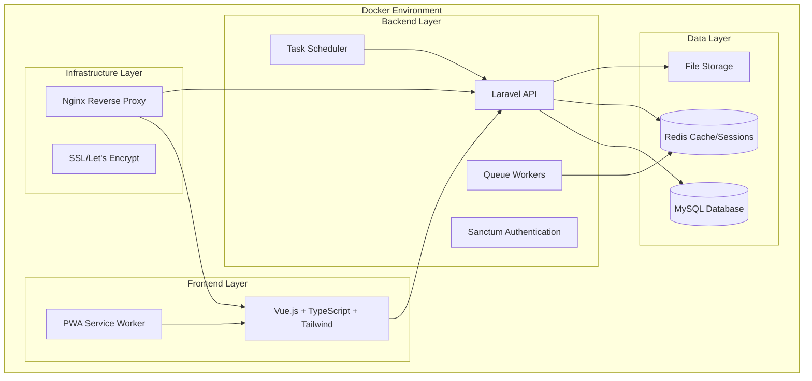

# Design Document

## Overview

The Bilingual Persian/English Jewelry Business Platform is designed as a single-user SaaS-style web application with enterprise-grade capabilities. The system follows a microservices-inspired architecture within a monolithic Laravel application, fully containerized using Docker. The platform supports seamless language switching between Persian (RTL) and English (LTR) with complete localization including Jalali calendar support.

The architecture emphasizes modularity, scalability, and maintainability while ensuring all components run exclusively in Docker containers. The system is designed to handle complex jewelry business operations including inventory management, customer relations, invoicing, and comprehensive accounting.

## Architecture

### System Architecture Overview



### Container Architecture

The application consists of the following Docker containers:

1. **app**: Laravel PHP-FPM container with Composer and Artisan
2. **frontend**: Vue.js development server with Hot Module Replacement
3. **mysql**: MySQL 8.0 database with persistent volumes
4. **redis**: Redis for caching, sessions, and queue management
5. **nginx**: Reverse proxy for production deployment
6. **scheduler**: Laravel scheduler for automated tasks
7. **queue**: Laravel queue workers with Horizon support

### Technology Stack

- **Backend**: Laravel 10+ with PHP 8.2+
- **Frontend**: Vue.js 3 + TypeScript + Vite + Tailwind CSS
- **Database**: MySQL 8.0
- **Cache/Queue**: Redis 7+
- **Authentication**: Laravel Sanctum
- **Internationalization**: Laravel Localization + vue-i18n
- **PWA**: Workbox for offline capabilities
- **Containerization**: Docker + Docker Compose

## Components and Interfaces

### Backend Components

#### 1. Authentication Module
- **Purpose**: Handle user authentication and session management
- **Components**:
  - `AuthController`: Login/logout endpoints
  - `UserService`: User management logic
  - `AuthMiddleware`: Request authentication
- **Interfaces**:
  - `POST /api/auth/login`
  - `POST /api/auth/logout`
  - `GET /api/auth/user`

#### 2. Dashboard Module
- **Purpose**: Provide real-time business analytics and KPIs
- **Components**:
  - `DashboardController`: Analytics endpoints
  - `KPIService`: Business metrics calculation
  - `WidgetService`: Dashboard widget management
- **Interfaces**:
  - `GET /api/dashboard/kpis`
  - `GET /api/dashboard/widgets`
  - `POST /api/dashboard/widgets/layout`

#### 3. Invoicing Module
- **Purpose**: Handle invoice creation, templates, and billing
- **Components**:
  - `InvoiceController`: CRUD operations
  - `InvoiceTemplateService`: Template management
  - `InvoiceGeneratorService`: PDF generation
  - `RecurringInvoiceService`: Automated invoicing
- **Interfaces**:
  - `GET /api/invoices`
  - `POST /api/invoices`
  - `GET /api/invoices/{id}/pdf`
  - `POST /api/invoice-templates`

#### 4. Inventory Module
- **Purpose**: Manage jewelry inventory across multiple locations
- **Components**:
  - `InventoryController`: Stock management
  - `LocationService`: Multi-location tracking
  - `SerialNumberService`: Serial/batch tracking
  - `AuditService`: Stock audit functionality
- **Interfaces**:
  - `GET /api/inventory/items`
  - `POST /api/inventory/items`
  - `POST /api/inventory/audit`
  - `GET /api/inventory/movements`

#### 5. Customer Management Module
- **Purpose**: Handle customer relationships and communications
- **Components**:
  - `CustomerController`: Customer CRUD
  - `CRMService`: Sales pipeline management
  - `CommunicationService`: WhatsApp/SMS integration
  - `CustomerReportService`: Aging and analytics
- **Interfaces**:
  - `GET /api/customers`
  - `POST /api/customers`
  - `POST /api/customers/{id}/communicate`
  - `GET /api/customers/{id}/aging`

#### 6. Accounting Module
- **Purpose**: Comprehensive financial management and reporting
- **Components**:
  - `AccountingController`: Financial operations
  - `LedgerService`: General ledger management
  - `ReportService`: Financial report generation
  - `TaxService`: Tax calculation and reporting
- **Interfaces**:
  - `GET /api/accounting/ledger`
  - `POST /api/accounting/transactions`
  - `GET /api/accounting/reports/{type}`
  - `GET /api/accounting/tax-reports`

#### 7. Localization Module
- **Purpose**: Handle bilingual support and localization
- **Components**:
  - `LocalizationController`: Language switching
  - `TranslationService`: Dynamic translations
  - `CalendarService`: Jalali/Gregorian conversion
  - `NumberService`: Persian/English numeral conversion
- **Interfaces**:
  - `GET /api/localization/translations/{locale}`
  - `POST /api/localization/switch-language`
  - `GET /api/localization/calendar/{type}`

### Frontend Components

#### 1. Layout Components
- **AppLayout**: Main application wrapper with navigation
- **Sidebar**: Collapsible navigation sidebar
- **Header**: Top navigation with language switcher
- **Footer**: Application footer

#### 2. Dashboard Components
- **DashboardView**: Main dashboard container
- **KPIWidget**: Individual KPI display widgets
- **ChartWidget**: Sales and analytics charts
- **AlertWidget**: Business alerts and notifications

#### 3. Invoice Components
- **InvoiceList**: Invoice listing with filters
- **InvoiceForm**: Invoice creation/editing form
- **InvoiceTemplate**: Template designer interface
- **InvoicePDF**: PDF preview component

#### 4. Inventory Components
- **InventoryList**: Item listing with search/filter
- **ItemForm**: Item creation/editing form
- **LocationManager**: Multi-location stock management
- **AuditInterface**: Stock audit functionality

#### 5. Customer Components
- **CustomerList**: Customer listing and search
- **CustomerForm**: Customer profile management
- **CRMPipeline**: Sales pipeline visualization
- **CommunicationCenter**: WhatsApp/SMS interface

#### 6. Accounting Components
- **LedgerView**: General ledger interface
- **ReportGenerator**: Financial report creation
- **TransactionForm**: Transaction entry form
- **TaxReports**: Tax reporting interface

#### 7. Localization Components
- **LanguageSwitcher**: Language toggle component
- **RTLProvider**: RTL/LTR layout provider
- **DatePicker**: Jalali/Gregorian date picker
- **NumberFormatter**: Persian/English number display

## Data Models

### Core Entities

#### User Model
```php
class User extends Model
{
    protected $fillable = [
        'name', 'email', 'password', 'preferred_language',
        'role', 'is_active', 'last_login_at'
    ];
    
    protected $casts = [
        'last_login_at' => 'datetime',
        'is_active' => 'boolean'
    ];
}
```

#### Customer Model
```php
class Customer extends Model
{
    protected $fillable = [
        'name', 'email', 'phone', 'address', 'preferred_language',
        'customer_type', 'credit_limit', 'payment_terms', 'notes'
    ];
    
    protected $casts = [
        'credit_limit' => 'decimal:2',
        'payment_terms' => 'integer'
    ];
    
    public function invoices() { return $this->hasMany(Invoice::class); }
    public function communications() { return $this->hasMany(Communication::class); }
}
```

#### Invoice Model
```php
class Invoice extends Model
{
    protected $fillable = [
        'customer_id', 'invoice_number', 'issue_date', 'due_date',
        'subtotal', 'tax_amount', 'total_amount', 'status',
        'language', 'template_id', 'notes'
    ];
    
    protected $casts = [
        'issue_date' => 'date',
        'due_date' => 'date',
        'subtotal' => 'decimal:2',
        'tax_amount' => 'decimal:2',
        'total_amount' => 'decimal:2'
    ];
    
    public function customer() { return $this->belongsTo(Customer::class); }
    public function items() { return $this->hasMany(InvoiceItem::class); }
    public function template() { return $this->belongsTo(InvoiceTemplate::class); }
}
```

#### InventoryItem Model
```php
class InventoryItem extends Model
{
    protected $fillable = [
        'name', 'description', 'sku', 'category_id', 'location_id',
        'quantity', 'unit_price', 'cost_price', 'gold_purity',
        'weight', 'serial_number', 'batch_number', 'expiry_date'
    ];
    
    protected $casts = [
        'quantity' => 'decimal:3',
        'unit_price' => 'decimal:2',
        'cost_price' => 'decimal:2',
        'gold_purity' => 'decimal:3',
        'weight' => 'decimal:3',
        'expiry_date' => 'date'
    ];
    
    public function category() { return $this->belongsTo(Category::class); }
    public function location() { return $this->belongsTo(Location::class); }
    public function movements() { return $this->hasMany(InventoryMovement::class); }
}
```

#### Transaction Model
```php
class Transaction extends Model
{
    protected $fillable = [
        'account_id', 'reference_number', 'description', 'debit_amount',
        'credit_amount', 'transaction_date', 'type', 'is_locked'
    ];
    
    protected $casts = [
        'debit_amount' => 'decimal:2',
        'credit_amount' => 'decimal:2',
        'transaction_date' => 'date',
        'is_locked' => 'boolean'
    ];
    
    public function account() { return $this->belongsTo(Account::class); }
}
```

### Relationship Mappings

- **Customer** → **Invoice** (One-to-Many)
- **Invoice** → **InvoiceItem** (One-to-Many)
- **InventoryItem** → **Category** (Many-to-One)
- **InventoryItem** → **Location** (Many-to-One)
- **Transaction** → **Account** (Many-to-One)
- **User** → **ActivityLog** (One-to-Many)

## Error Handling

### Backend Error Handling

#### Exception Hierarchy
```php
// Base application exception
class JewelryPlatformException extends Exception {}

// Specific exceptions
class InvoiceGenerationException extends JewelryPlatformException {}
class InventoryInsufficientException extends JewelryPlatformException {}
class LocalizationException extends JewelryPlatformException {}
class AccountingLockedException extends JewelryPlatformException {}
```

#### Error Response Format
```json
{
    "success": false,
    "error": {
        "code": "INVOICE_GENERATION_FAILED",
        "message": "Unable to generate invoice PDF",
        "details": {
            "template_id": 123,
            "customer_id": 456
        }
    },
    "timestamp": "2024-01-15T10:30:00Z"
}
```

### Frontend Error Handling

#### Error Boundary Component
```typescript
// Global error boundary for Vue components
class ErrorBoundary {
    handleError(error: Error, instance: ComponentPublicInstance) {
        // Log error to monitoring service
        console.error('Component Error:', error);
        
        // Show user-friendly message
        this.showErrorNotification(error);
        
        // Report to error tracking service
        this.reportError(error, instance);
    }
}
```

#### API Error Interceptor
```typescript
// Axios response interceptor for API errors
axios.interceptors.response.use(
    response => response,
    error => {
        if (error.response?.status === 401) {
            // Handle authentication errors
            router.push('/login');
        } else if (error.response?.status >= 500) {
            // Handle server errors
            showErrorToast('Server error occurred');
        }
        return Promise.reject(error);
    }
);
```

## Testing Strategy

### Backend Testing

#### Unit Tests
- **Service Layer Tests**: Test business logic in isolation
- **Model Tests**: Test data validation and relationships
- **Utility Tests**: Test helper functions and utilities

#### Integration Tests
- **API Endpoint Tests**: Test complete request/response cycles
- **Database Tests**: Test data persistence and retrieval
- **Queue Tests**: Test background job processing

#### Feature Tests
- **Invoice Generation**: End-to-end invoice creation and PDF generation
- **Inventory Management**: Complete inventory workflow testing
- **Localization**: Language switching and data formatting

### Frontend Testing

#### Unit Tests
- **Component Tests**: Test individual Vue components
- **Service Tests**: Test API service functions
- **Utility Tests**: Test helper functions and formatters

#### Integration Tests
- **Page Tests**: Test complete page functionality
- **Form Tests**: Test form validation and submission
- **Navigation Tests**: Test routing and navigation

#### End-to-End Tests
- **User Workflows**: Test complete business processes
- **Cross-browser Tests**: Test compatibility across browsers
- **Mobile Tests**: Test responsive design and PWA functionality

### Docker Testing Environment

#### Test Database Setup
```yaml
# docker-compose.test.yml
services:
  test-mysql:
    image: mysql:8.0
    environment:
      MYSQL_DATABASE: jewelry_test
      MYSQL_ROOT_PASSWORD: test_password
    volumes:
      - test_db_data:/var/lib/mysql
      
  test-redis:
    image: redis:7-alpine
    
  test-app:
    build: .
    environment:
      APP_ENV: testing
      DB_HOST: test-mysql
      REDIS_HOST: test-redis
    depends_on:
      - test-mysql
      - test-redis
```

#### Test Execution Strategy
1. **Parallel Testing**: Run tests in parallel containers
2. **Database Isolation**: Each test suite uses isolated database
3. **Cache Clearing**: Redis cache cleared between test suites
4. **File System**: Temporary file storage for test artifacts

### Continuous Integration

#### GitHub Actions Workflow
```yaml
name: Test Suite
on: [push, pull_request]
jobs:
  test:
    runs-on: ubuntu-latest
    steps:
      - uses: actions/checkout@v3
      - name: Build Docker containers
        run: docker-compose -f docker-compose.test.yml build
      - name: Run backend tests
        run: docker-compose -f docker-compose.test.yml run test-app php artisan test
      - name: Run frontend tests
        run: docker-compose -f docker-compose.test.yml run frontend npm test
```

This comprehensive design provides a solid foundation for building the bilingual jewelry business platform with all the enterprise features specified in the requirements while maintaining the Docker-first approach and ensuring proper localization support.