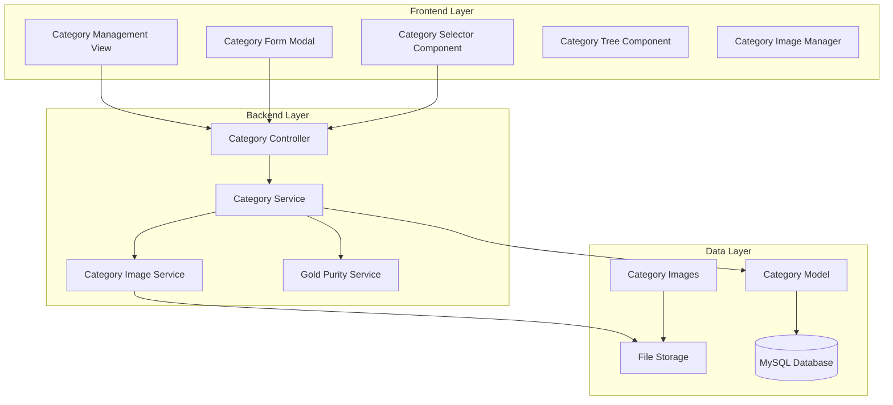

# Design Document

## Overview

The Jewelry Category Management System is designed to provide a comprehensive hierarchical category structure specifically tailored for jewelry businesses. The system extends the existing category functionality to include gold purity specifications (عیار طلا), image management, and enhanced bilingual support. The design integrates seamlessly with the existing Docker-based Laravel/Vue.js architecture while adding specialized features for jewelry inventory management.

The system follows a hierarchical tree structure where main categories can have multiple subcategories, each with their own specifications, images, and gold purity settings. The design emphasizes user experience with intuitive category selection, visual representation, and proper localization for Persian/English languages.

## Architecture

### System Architecture Overview



### Enhanced Category Model Structure

The existing Category model will be extended to support jewelry-specific features:

```php
class Category extends Model
{
    protected $fillable = [
        'name',
        'name_persian', 
        'description',
        'description_persian',
        'code',
        'is_active',
        'parent_id',
        'default_gold_purity',    // New: Default gold purity for items
        'image_path',             // New: Category image
        'sort_order',             // New: For custom ordering
        'specifications',         // New: JSON field for category-specific specs
    ];
}
```

### Database Schema Extensions

#### Categories Table Enhancement
```sql
ALTER TABLE categories ADD COLUMN default_gold_purity DECIMAL(5,3) NULL;
ALTER TABLE categories ADD COLUMN image_path VARCHAR(255) NULL;
ALTER TABLE categories ADD COLUMN sort_order INTEGER DEFAULT 0;
ALTER TABLE categories ADD COLUMN specifications JSON NULL;
```

#### New Category Images Table
```sql
CREATE TABLE category_images (
    id BIGINT UNSIGNED AUTO_INCREMENT PRIMARY KEY,
    category_id BIGINT UNSIGNED NOT NULL,
    image_path VARCHAR(255) NOT NULL,
    alt_text VARCHAR(255) NULL,
    alt_text_persian VARCHAR(255) NULL,
    is_primary BOOLEAN DEFAULT FALSE,
    sort_order INTEGER DEFAULT 0,
    created_at TIMESTAMP NULL,
    updated_at TIMESTAMP NULL,
    FOREIGN KEY (category_id) REFERENCES categories(id) ON DELETE CASCADE
);
```

## Components and Interfaces

### Backend Components

#### 1. Enhanced Category Controller
```php
class CategoryController extends Controller
{
    // Existing methods enhanced
    public function index(Request $request): JsonResponse
    public function store(Request $request): JsonResponse  
    public function show(Category $category): JsonResponse
    public function update(Request $request, Category $category): JsonResponse
    public function destroy(Category $category): JsonResponse
    
    // New methods for jewelry features
    public function getHierarchy(): JsonResponse
    public function uploadImage(Request $request, Category $category): JsonResponse
    public function removeImage(Category $category): JsonResponse
    public function reorder(Request $request): JsonResponse
    public function getGoldPurityOptions(): JsonResponse
}
```

#### 2. Category Service
```php
class CategoryService
{
    public function createCategory(array $data): Category
    public function updateCategory(Category $category, array $data): Category
    public function deleteCategory(Category $category): bool
    public function getHierarchicalTree(): Collection
    public function reorderCategories(array $orderData): bool
    public function validateHierarchy(int $categoryId, ?int $parentId): bool
}
```

#### 3. Category Image Service
```php
class CategoryImageService
{
    public function uploadImage(Category $category, UploadedFile $image): string
    public function removeImage(Category $category): bool
    public function optimizeImage(string $imagePath): string
    public function generateThumbnails(string $imagePath): array
}
```

#### 4. Gold Purity Service
```php
class GoldPurityService
{
    public function getStandardPurities(): array
    public function formatPurityDisplay(float $purity, string $locale): string
    public function convertKaratToPurity(float $karat): float
    public function getPurityRanges(): array
}
```

### Frontend Components

#### 1. Category Management View
```vue
<!-- Enhanced InventoryView with Categories tab -->
<template>
  <div class="space-y-6">
    <!-- Existing header and tabs -->
    <div class="border-b border-gray-200 dark:border-gray-700">
      <nav class="-mb-px flex space-x-8">
        <button v-for="tab in tabs" :key="tab.key">
          {{ $t(tab.label) }}
        </button>
      </nav>
    </div>
    
    <!-- Categories Tab Content -->
    <div v-if="activeTab === 'categories'">
      <CategoryManagement />
    </div>
  </div>
</template>
```

#### 2. Category Management Component
```vue
<template>
  <div class="space-y-6">
    <!-- Category Actions Header -->
    <div class="sm:flex sm:items-center sm:justify-between">
      <div class="sm:flex-auto">
        <h2 class="text-lg font-medium text-gray-900 dark:text-white">
          {{ $t("categories.title") }}
        </h2>
      </div>
      <div class="mt-4 sm:mt-0 sm:flex-none">
        <button @click="showCreateModal = true" class="btn-primary">
          <PlusIcon class="h-4 w-4 mr-2" />
          {{ $t("categories.add_category") }}
        </button>
      </div>
    </div>
    
    <!-- Category Tree View -->
    <CategoryTree 
      :categories="categories"
      @edit="editCategory"
      @delete="deleteCategory"
      @reorder="reorderCategories"
    />
    
    <!-- Category Form Modal -->
    <CategoryFormModal
      v-if="showCreateModal || showEditModal"
      :category="selectedCategory"
      :is-edit="showEditModal"
      @close="closeModals"
      @saved="handleCategorySaved"
    />
  </div>
</template>
```

#### 3. Category Tree Component
```vue
<template>
  <div class="bg-white dark:bg-gray-800 shadow rounded-lg">
    <div class="px-4 py-5 sm:p-6">
      <div class="space-y-4">
        <CategoryTreeNode
          v-for="category in rootCategories"
          :key="category.id"
          :category="category"
          :level="0"
          @edit="$emit('edit', $event)"
          @delete="$emit('delete', $event)"
          @reorder="$emit('reorder', $event)"
        />
      </div>
    </div>
  </div>
</template>
```

#### 4. Category Form Modal
```vue
<template>
  <div class="fixed inset-0 z-50 overflow-y-auto">
    <div class="modal-container">
      <form @submit.prevent="handleSubmit" class="p-6">
        <!-- Basic Information -->
        <div class="grid grid-cols-1 md:grid-cols-2 gap-6">
          <!-- Category Name -->
          <div>
            <label class="form-label">{{ $t("categories.name") }} *</label>
            <input v-model="form.name" type="text" required class="form-input" />
          </div>
          
          <!-- Category Name Persian -->
          <div>
            <label class="form-label">{{ $t("categories.name_persian") }}</label>
            <input v-model="form.name_persian" type="text" dir="rtl" class="form-input" />
          </div>
          
          <!-- Parent Category -->
          <div>
            <label class="form-label">{{ $t("categories.parent_category") }}</label>
            <CategorySelector
              v-model="form.parent_id"
              :exclude-id="category?.id"
              :placeholder="$t('categories.select_parent')"
            />
          </div>
          
          <!-- Category Code -->
          <div>
            <label class="form-label">{{ $t("categories.code") }} *</label>
            <input v-model="form.code" type="text" required class="form-input" />
          </div>
          
          <!-- Default Gold Purity -->
          <div>
            <label class="form-label">{{ $t("categories.default_gold_purity") }}</label>
            <GoldPuritySelector v-model="form.default_gold_purity" />
          </div>
          
          <!-- Category Image -->
          <div class="md:col-span-2">
            <label class="form-label">{{ $t("categories.image") }}</label>
            <CategoryImageUpload
              v-model="form.image"
              :current-image="category?.image_path"
              @uploaded="handleImageUploaded"
            />
          </div>
          
          <!-- Description -->
          <div class="md:col-span-2">
            <label class="form-label">{{ $t("categories.description") }}</label>
            <textarea v-model="form.description" rows="3" class="form-input"></textarea>
          </div>
          
          <!-- Description Persian -->
          <div class="md:col-span-2">
            <label class="form-label">{{ $t("categories.description_persian") }}</label>
            <textarea v-model="form.description_persian" rows="3" dir="rtl" class="form-input"></textarea>
          </div>
        </div>
        
        <!-- Form Actions -->
        <div class="mt-8 flex justify-end space-x-3">
          <button type="button" @click="$emit('close')" class="btn-secondary">
            {{ $t("common.cancel") }}
          </button>
          <button type="submit" :disabled="loading" class="btn-primary">
            {{ isEdit ? $t("common.update") : $t("common.create") }}
          </button>
        </div>
      </form>
    </div>
  </div>
</template>
```

#### 5. Enhanced Item Form with Category Selection
```vue
<template>
  <div class="category-selection">
    <!-- Main Category -->
    <div>
      <label class="form-label">{{ $t("inventory.main_category") }}</label>
      <select v-model="form.main_category_id" @change="onMainCategoryChange" class="form-input">
        <option value="">{{ $t("inventory.select_main_category") }}</option>
        <option v-for="category in mainCategories" :key="category.id" :value="category.id">
          
          {{ category.localized_name }}
        </option>
      </select>
    </div>
    
    <!-- Subcategory -->
    <div v-if="availableSubcategories.length > 0">
      <label class="form-label">{{ $t("inventory.subcategory") }}</label>
      <select v-model="form.category_id" @change="onSubcategoryChange" class="form-input">
        <option value="">{{ $t("inventory.select_subcategory") }}</option>
        <option v-for="subcategory in availableSubcategories" :key="subcategory.id" :value="subcategory.id">
          
          {{ subcategory.localized_name }}
        </option>
      </select>
    </div>
    
    <!-- Auto-populated Gold Purity -->
    <div v-if="selectedCategory?.default_gold_purity">
      <label class="form-label">{{ $t("inventory.gold_purity") }}</label>
      <input 
        v-model.number="form.gold_purity" 
        type="number" 
        step="0.001" 
        class="form-input"
        :placeholder="selectedCategory.default_gold_purity"
      />
      <p class="text-xs text-gray-500 mt-1">
        {{ $t("inventory.default_from_category", { purity: formatGoldPurity(selectedCategory.default_gold_purity) }) }}
      </p>
    </div>
  </div>
</template>
```

## Data Models

### Enhanced Category Model
```php
class Category extends Model
{
    protected $fillable = [
        'name',
        'name_persian',
        'description', 
        'description_persian',
        'code',
        'is_active',
        'parent_id',
        'default_gold_purity',
        'image_path',
        'sort_order',
        'specifications',
    ];

    protected $casts = [
        'is_active' => 'boolean',
        'default_gold_purity' => 'decimal:3',
        'sort_order' => 'integer',
        'specifications' => 'array',
    ];

    // Existing relationships
    public function parent(): BelongsTo
    public function children(): HasMany  
    public function inventoryItems(): HasMany
    
    // New relationships
    public function images(): HasMany
    {
        return $this->hasMany(CategoryImage::class);
    }
    
    public function primaryImage(): HasOne
    {
        return $this->hasOne(CategoryImage::class)->where('is_primary', true);
    }
    
    // New methods
    public function getFormattedGoldPurityAttribute(): ?string
    {
        if (!$this->default_gold_purity) return null;
        
        $locale = app()->getLocale();
        return app(GoldPurityService::class)->formatPurityDisplay($this->default_gold_purity, $locale);
    }
    
    public function getItemCountAttribute(): int
    {
        return $this->inventoryItems()->count() + 
               $this->children()->withCount('inventoryItems')->get()->sum('inventory_items_count');
    }
    
    public function getHasChildrenAttribute(): bool
    {
        return $this->children()->exists();
    }
}
```

### New Category Image Model
```php
class CategoryImage extends Model
{
    protected $fillable = [
        'category_id',
        'image_path',
        'alt_text',
        'alt_text_persian', 
        'is_primary',
        'sort_order',
    ];

    protected $casts = [
        'is_primary' => 'boolean',
        'sort_order' => 'integer',
    ];

    public function category(): BelongsTo
    {
        return $this->belongsTo(Category::class);
    }
    
    public function getLocalizedAltTextAttribute(): ?string
    {
        $locale = app()->getLocale();
        return $locale === 'fa' && $this->alt_text_persian ? $this->alt_text_persian : $this->alt_text;
    }
    
    public function getFullUrlAttribute(): string
    {
        return Storage::url($this->image_path);
    }
}
```

### Enhanced Inventory Item Model
```php
class InventoryItem extends Model
{
    // Add subcategory_id to fillable
    protected $fillable = [
        // ... existing fields
        'category_id',        // This becomes subcategory_id
        'main_category_id',   // New: for main category
        // ... rest of fields
    ];
    
    // New relationship for main category
    public function mainCategory(): BelongsTo
    {
        return $this->belongsTo(Category::class, 'main_category_id');
    }
    
    // Enhanced category relationship (now subcategory)
    public function subcategory(): BelongsTo
    {
        return $this->belongsTo(Category::class, 'category_id');
    }
    
    // Alias for backward compatibility
    public function category(): BelongsTo
    {
        return $this->subcategory();
    }
    
    // New method to get full category path
    public function getCategoryPathAttribute(): string
    {
        $path = [];
        if ($this->mainCategory) {
            $path[] = $this->mainCategory->localized_name;
        }
        if ($this->subcategory) {
            $path[] = $this->subcategory->localized_name;
        }
        return implode(' > ', $path);
    }
}
```

## API Interfaces

### Category Management Endpoints
```php
// Enhanced existing endpoints
GET    /api/categories                    // List with hierarchy support
POST   /api/categories                    // Create with image upload
GET    /api/categories/{id}               // Show with full details
PUT    /api/categories/{id}               // Update with image handling
DELETE /api/categories/{id}               // Delete with validation

// New endpoints for jewelry features
GET    /api/categories/hierarchy          // Get full hierarchical tree
POST   /api/categories/{id}/image         // Upload category image
DELETE /api/categories/{id}/image         // Remove category image
POST   /api/categories/reorder            // Reorder categories
GET    /api/categories/gold-purity-options // Get standard gold purity options
```

### Enhanced Inventory Endpoints
```php
// Modified to support dual category selection
GET    /api/inventory/items?main_category_id=1&category_id=2
POST   /api/inventory/items               // With main_category_id and category_id
```

## Error Handling

### Category-Specific Exceptions
```php
class CategoryException extends Exception {}
class CategoryHierarchyException extends CategoryException {}
class CategoryImageException extends CategoryException {}
class CategoryDeletionException extends CategoryException {}
```

### Validation Rules
```php
class CategoryRequest extends FormRequest
{
    public function rules(): array
    {
        return [
            'name' => 'required|string|max:255',
            'name_persian' => 'nullable|string|max:255',
            'code' => 'required|string|max:10|unique:categories,code,' . $this->category?->id,
            'parent_id' => [
                'nullable',
                'exists:categories,id',
                new NoCircularReference($this->category?->id),
            ],
            'default_gold_purity' => 'nullable|numeric|min:0|max:24',
            'image' => 'nullable|image|mimes:jpeg,png,jpg,webp|max:2048',
        ];
    }
}
```

## Testing Strategy

### Backend Testing
```php
class CategoryManagementTest extends TestCase
{
    public function test_can_create_category_with_image()
    public function test_can_create_subcategory()
    public function test_cannot_create_circular_reference()
    public function test_can_upload_category_image()
    public function test_can_set_gold_purity_default()
    public function test_can_reorder_categories()
    public function test_cannot_delete_category_with_items()
}
```

### Frontend Testing
```typescript
describe('CategoryManagement', () => {
  it('should display category tree correctly')
  it('should allow creating main categories')
  it('should allow creating subcategories')
  it('should handle image upload')
  it('should validate gold purity input')
  it('should support drag and drop reordering')
})
```

## Docker Integration

### File Storage Configuration
```yaml
# docker-compose.yml
services:
  app:
    volumes:
      - ./storage/app/public/categories:/var/www/html/storage/app/public/categories
      
  nginx:
    volumes:
      - ./storage/app/public:/var/www/html/storage/app/public
```

### Image Processing
```php
// Use Intervention Image for Docker-compatible image processing
class CategoryImageService
{
    public function processImage(UploadedFile $image): string
    {
        $manager = new ImageManager(['driver' => 'gd']); // GD works better in Docker
        $processedImage = $manager->make($image)
            ->resize(400, 400, function ($constraint) {
                $constraint->aspectRatio();
                $constraint->upsize();
            });
            
        // Save optimized image
        $path = 'categories/' . Str::uuid() . '.webp';
        Storage::put($path, $processedImage->encode('webp', 85));
        
        return $path;
    }
}
```

This comprehensive design provides a robust foundation for implementing the jewelry category management system with hierarchical structure, gold purity specifications, image support, and seamless integration with the existing Docker-based architecture.