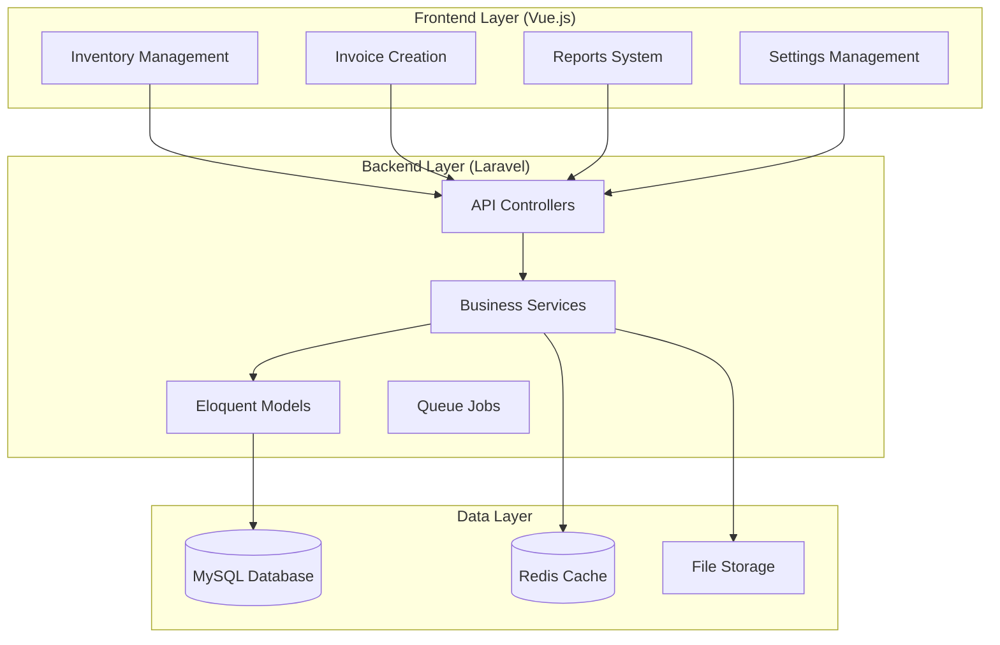

# Design Document

## Overview

This design document outlines the solution for fixing critical production issues in the jewelry platform. The solution addresses console errors in inventory item creation, implements optional pricing fields for dynamic gold pricing, creates a comprehensive invoice-inventory relationship system, and fixes the reporting system to use real data. The design maintains the existing Docker-based Laravel/Vue.js architecture while implementing the Persian jewelry industry pricing formula.

## Architecture

### System Architecture Overview



### Dynamic Gold Pricing Architecture

```mermaid
graph LR
    subgraph "Settings Configuration"
        DEFAULT_TAX[Default Tax %]
        DEFAULT_PROFIT[Default Profit %]
        DEFAULT_LABOR[Default Labor %]
    end
    
    subgraph "Invoice Creation"
        GOLD_PRICE[Current Gold Price/gram]
        ITEM_WEIGHT[Item Weight]
        CUSTOM_TAX[Custom Tax %]
        CUSTOM_PROFIT[Custom Profit %]
        CUSTOM_LABOR[Custom Labor %]
    end
    
    subgraph "Price Calculation"
        FORMULA[Weight × (Gold Price + Labor + Profit + Tax)]
        FINAL_PRICE[Final Price]
    end
    
    DEFAULT_TAX --> CUSTOM_TAX
    DEFAULT_PROFIT --> CUSTOM_PROFIT
    DEFAULT_LABOR --> CUSTOM_LABOR
    
    GOLD_PRICE --> FORMULA
    ITEM_WEIGHT --> FORMULA
    CUSTOM_TAX --> FORMULA
    CUSTOM_PROFIT --> FORMULA
    CUSTOM_LABOR --> FORMULA
    
    FORMULA --> FINAL_PRICE
```

## Components and Interfaces

### 1. Inventory Item Creation Fix

#### Frontend Component Updates
```vue
<!-- ItemFormModal.vue -->
<template>
  <div class="item-form-modal">
    <form @submit.prevent="createItem">
      <!-- Basic Information -->
      <div class="form-section">
        <h4>{{ $t('inventory.basic_information') }}</h4>
        
        <!-- Required fields -->
        <FormField 
          :label="$t('inventory.sku')" 
          v-model="form.sku" 
          required 
          :error="errors.sku"
        />
        
        <!-- Optional pricing fields (remove required indicators) -->
        <FormField 
          :label="$t('inventory.unit_price')" 
          v-model="form.unit_price" 
          type="number"
          :placeholder="$t('inventory.price_on_request')"
          :error="errors.unit_price"
        />
        
        <FormField 
          :label="$t('inventory.cost_price')" 
          v-model="form.cost_price" 
          type="number"
          :placeholder="$t('inventory.price_on_request')"
          :error="errors.cost_price"
        />
      </div>
      
      <!-- Jewelry Information -->
      <div class="form-section">
        <h4>{{ $t('inventory.jewelry_information') }}</h4>
        
        <FormField 
          :label="$t('inventory.gold_purity')" 
          v-model="form.gold_purity" 
          type="number"
          step="0.001"
          :placeholder="$t('inventory.enter_gold_purity')"
        />
        
        <FormField 
          :label="$t('inventory.weight')" 
          v-model="form.weight" 
          type="number"
          step="0.001"
          :placeholder="$t('inventory.enter_weight_grams')"
        />
      </div>
    </form>
  </div>
</template>

<script setup lang="ts">
import { ref, onMounted } from 'vue'
import { useApi } from '@/composables/useApi'

const { api } = useApi()
const form = ref({
  sku: '',
  name: '',
  unit_price: null, // Allow null values
  cost_price: null, // Allow null values
  gold_purity: null,
  weight: null,
  category_id: null,
  location_id: null
})

const errors = ref({})
const loading = ref(false)

// Fix API calls with proper error handling
const loadFormData = async () => {
  try {
    const [categories, locations, goldPurityOptions] = await Promise.all([
      api.get('/inventory/categories'),
      api.get('/inventory/locations'),
      api.get('/inventory/gold-purity-options')
    ])
    
    // Handle successful responses
    categoriesData.value = categories.data
    locationsData.value = locations.data
    goldPurityData.value = goldPurityOptions.data
    
  } catch (error) {
    console.error('Failed to load form data:', error)
    // Show user-friendly error message
    showError($t('inventory.failed_to_load_form_data'))
  }
}

const createItem = async () => {
  loading.value = true
  errors.value = {}
  
  try {
    const response = await api.post('/inventory/items', form.value)
    
    // Success handling
    showSuccess($t('inventory.item_created_successfully'))
    emit('item-created', response.data)
    closeModal()
    
  } catch (error) {
    if (error.response?.status === 422) {
      errors.value = error.response.data.errors
    } else {
      showError($t('inventory.failed_to_create_item'))
    }
  } finally {
    loading.value = false
  }
}

onMounted(() => {
  loadFormData()
})
</script>
```

#### Backend API Fixes
```php
// app/Http/Controllers/InventoryController.php
class InventoryController extends Controller
{
    public function store(StoreInventoryItemRequest $request)
    {
        try {
            $item = $this->inventoryService->createItem($request->validated());
            
            return response()->json([
                'success' => true,
                'message' => __('inventory.item_created_successfully'),
                'data' => new InventoryItemResource($item)
            ], 201);
            
        } catch (ValidationException $e) {
            return response()->json([
                'success' => false,
                'message' => __('inventory.validation_failed'),
                'errors' => $e->errors()
            ], 422);
            
        } catch (Exception $e) {
            Log::error('Failed to create inventory item', [
                'error' => $e->getMessage(),
                'request_data' => $request->all()
            ]);
            
            return response()->json([
                'success' => false,
                'message' => __('inventory.creation_failed')
            ], 500);
        }
    }
    
    public function getCategories()
    {
        try {
            $categories = Category::with('children')
                ->whereNull('parent_id')
                ->orderBy('name')
                ->get();
                
            return response()->json([
                'success' => true,
                'data' => CategoryResource::collection($categories)
            ]);
            
        } catch (Exception $e) {
            Log::error('Failed to load categories', ['error' => $e->getMessage()]);
            
            return response()->json([
                'success' => false,
                'message' => __('inventory.failed_to_load_categories')
            ], 500);
        }
    }
    
    public function getLocations()
    {
        try {
            $locations = Location::orderBy('name')->get();
            
            return response()->json([
                'success' => true,
                'data' => LocationResource::collection($locations)
            ]);
            
        } catch (Exception $e) {
            Log::error('Failed to load locations', ['error' => $e->getMessage()]);
            
            return response()->json([
                'success' => false,
                'message' => __('inventory.failed_to_load_locations')
            ], 500);
        }
    }
    
    public function getGoldPurityOptions()
    {
        try {
            $options = [
                ['value' => 18.000, 'label' => '18K (18.000)'],
                ['value' => 21.000, 'label' => '21K (21.000)'],
                ['value' => 22.000, 'label' => '22K (22.000)'],
                ['value' => 24.000, 'label' => '24K (24.000)']
            ];
            
            return response()->json([
                'success' => true,
                'data' => $options
            ]);
            
        } catch (Exception $e) {
            Log::error('Failed to load gold purity options', ['error' => $e->getMessage()]);
            
            return response()->json([
                'success' => false,
                'message' => __('inventory.failed_to_load_gold_purity_options')
            ], 500);
        }
    }
}

// app/Http/Requests/StoreInventoryItemRequest.php
class StoreInventoryItemRequest extends FormRequest
{
    public function rules()
    {
        return [
            'sku' => 'required|string|unique:inventory_items,sku',
            'name' => 'required|string|max:255',
            'name_persian' => 'nullable|string|max:255',
            'description' => 'nullable|string',
            'description_persian' => 'nullable|string',
            'category_id' => 'required|exists:categories,id',
            'location_id' => 'required|exists:locations,id',
            'quantity' => 'required|numeric|min:0',
            'minimum_stock' => 'nullable|numeric|min:0',
            'maximum_stock' => 'nullable|numeric|min:0',
            // Make prices optional
            'unit_price' => 'nullable|numeric|min:0',
            'cost_price' => 'nullable|numeric|min:0',
            'gold_purity' => 'nullable|numeric|min:0|max:24',
            'weight' => 'nullable|numeric|min:0',
            'serial_number' => 'nullable|string|unique:inventory_items,serial_number',
            'batch_number' => 'nullable|string',
            'expiry_date' => 'nullable|date',
            'track_serial_numbers' => 'boolean',
            'track_batch_numbers' => 'boolean',
            'is_active' => 'boolean'
        ];
    }
}
```

### 2. Dynamic Gold Pricing System

#### Invoice Creation with Dynamic Pricing
```vue
<!-- InvoiceFormModal.vue -->
<template>
  <div class="invoice-form">
    <!-- Gold Pricing Section -->
    <div class="pricing-section">
      <h4>{{ $t('invoice.gold_pricing') }}</h4>
      
      <div class="pricing-controls">
        <FormField 
          :label="$t('invoice.current_gold_price_per_gram')"
          v-model="goldPricing.pricePerGram"
          type="number"
          step="0.01"
          @input="recalculatePrices"
          required
        />
        
        <FormField 
          :label="$t('invoice.labor_cost_percentage')"
          v-model="goldPricing.laborPercentage"
          type="number"
          step="0.1"
          @input="recalculatePrices"
          :placeholder="defaultSettings.laborPercentage"
        />
        
        <FormField 
          :label="$t('invoice.profit_percentage')"
          v-model="goldPricing.profitPercentage"
          type="number"
          step="0.1"
          @input="recalculatePrices"
          :placeholder="defaultSettings.profitPercentage"
        />
        
        <FormField 
          :label="$t('invoice.tax_percentage')"
          v-model="goldPricing.taxPercentage"
          type="number"
          step="0.1"
          @input="recalculatePrices"
          :placeholder="defaultSettings.taxPercentage"
        />
      </div>
    </div>
    
    <!-- Invoice Items -->
    <div class="items-section">
      <h4>{{ $t('invoice.items') }}</h4>
      
      <div v-for="(item, index) in invoiceItems" :key="index" class="invoice-item">
        <ItemSelector 
          v-model="item.inventory_item_id"
          @change="updateItemDetails(index)"
        />
        
        <div class="item-details">
          <span>{{ $t('invoice.weight') }}: {{ item.weight }}g</span>
          <span>{{ $t('invoice.gold_purity') }}: {{ item.gold_purity }}K</span>
        </div>
        
        <FormField 
          :label="$t('invoice.quantity')"
          v-model="item.quantity"
          type="number"
          min="1"
          @input="recalculateItemPrice(index)"
        />
        
        <div class="price-breakdown">
          <div>{{ $t('invoice.base_gold_cost') }}: {{ formatCurrency(item.baseGoldCost) }}</div>
          <div>{{ $t('invoice.labor_cost') }}: {{ formatCurrency(item.laborCost) }}</div>
          <div>{{ $t('invoice.profit') }}: {{ formatCurrency(item.profit) }}</div>
          <div>{{ $t('invoice.tax') }}: {{ formatCurrency(item.tax) }}</div>
          <div class="total-price">{{ $t('invoice.total_price') }}: {{ formatCurrency(item.totalPrice) }}</div>
        </div>
      </div>
    </div>
  </div>
</template>

<script setup lang="ts">
import { ref, computed, onMounted, watch } from 'vue'
import { useApi } from '@/composables/useApi'
import { useSettings } from '@/composables/useSettings'

const { api } = useApi()
const { getBusinessSettings } = useSettings()

const goldPricing = ref({
  pricePerGram: 0,
  laborPercentage: 0,
  profitPercentage: 0,
  taxPercentage: 0
})

const defaultSettings = ref({
  laborPercentage: 0,
  profitPercentage: 0,
  taxPercentage: 0
})

const invoiceItems = ref([])

// Persian jewelry pricing formula implementation
const calculateItemPrice = (item: any) => {
  const weight = parseFloat(item.weight) || 0
  const goldPricePerGram = parseFloat(goldPricing.value.pricePerGram) || 0
  const laborPercentage = parseFloat(goldPricing.value.laborPercentage) || 0
  const profitPercentage = parseFloat(goldPricing.value.profitPercentage) || 0
  const taxPercentage = parseFloat(goldPricing.value.taxPercentage) || 0
  const quantity = parseInt(item.quantity) || 1
  
  // Base gold cost
  const baseGoldCost = weight * goldPricePerGram
  
  // Labor cost (percentage of base gold cost)
  const laborCost = baseGoldCost * (laborPercentage / 100)
  
  // Subtotal before profit and tax
  const subtotal = baseGoldCost + laborCost
  
  // Profit (percentage of subtotal)
  const profit = subtotal * (profitPercentage / 100)
  
  // Subtotal with profit
  const subtotalWithProfit = subtotal + profit
  
  // Tax (percentage of subtotal with profit)
  const tax = subtotalWithProfit * (taxPercentage / 100)
  
  // Final price per unit
  const unitPrice = subtotalWithProfit + tax
  
  // Total price for quantity
  const totalPrice = unitPrice * quantity
  
  return {
    baseGoldCost: baseGoldCost * quantity,
    laborCost: laborCost * quantity,
    profit: profit * quantity,
    tax: tax * quantity,
    unitPrice,
    totalPrice
  }
}

const recalculateItemPrice = (index: number) => {
  const item = invoiceItems.value[index]
  const pricing = calculateItemPrice(item)
  
  Object.assign(item, pricing)
}

const recalculatePrices = () => {
  invoiceItems.value.forEach((_, index) => {
    recalculateItemPrice(index)
  })
}

const loadDefaultSettings = async () => {
  try {
    const settings = await getBusinessSettings()
    defaultSettings.value = {
      laborPercentage: settings.default_labor_percentage || 0,
      profitPercentage: settings.default_profit_percentage || 0,
      taxPercentage: settings.default_tax_percentage || 0
    }
    
    // Set as initial values
    goldPricing.value = { ...defaultSettings.value, pricePerGram: 0 }
    
  } catch (error) {
    console.error('Failed to load default settings:', error)
  }
}

onMounted(() => {
  loadDefaultSettings()
})
</script>
```

#### Backend Pricing Service
```php
// app/Services/GoldPricingService.php
class GoldPricingService
{
    public function calculateItemPrice(array $params): array
    {
        $weight = (float) $params['weight'];
        $goldPricePerGram = (float) $params['gold_price_per_gram'];
        $laborPercentage = (float) $params['labor_percentage'];
        $profitPercentage = (float) $params['profit_percentage'];
        $taxPercentage = (float) $params['tax_percentage'];
        $quantity = (int) $params['quantity'];
        
        // Persian jewelry pricing formula
        // Weight × (Gold Price per gram + Labor Cost + Profit + Tax) = Final Price
        
        // Base gold cost
        $baseGoldCost = $weight * $goldPricePerGram;
        
        // Labor cost (percentage of base gold cost)
        $laborCost = $baseGoldCost * ($laborPercentage / 100);
        
        // Subtotal before profit and tax
        $subtotal = $baseGoldCost + $laborCost;
        
        // Profit (percentage of subtotal)
        $profit = $subtotal * ($profitPercentage / 100);
        
        // Subtotal with profit
        $subtotalWithProfit = $subtotal + $profit;
        
        // Tax (percentage of subtotal with profit)
        $tax = $subtotalWithProfit * ($taxPercentage / 100);
        
        // Final price per unit
        $unitPrice = $subtotalWithProfit + $tax;
        
        // Total price for quantity
        $totalPrice = $unitPrice * $quantity;
        
        return [
            'base_gold_cost' => round($baseGoldCost * $quantity, 2),
            'labor_cost' => round($laborCost * $quantity, 2),
            'profit' => round($profit * $quantity, 2),
            'tax' => round($tax * $quantity, 2),
            'unit_price' => round($unitPrice, 2),
            'total_price' => round($totalPrice, 2),
            'breakdown' => [
                'weight' => $weight,
                'gold_price_per_gram' => $goldPricePerGram,
                'labor_percentage' => $laborPercentage,
                'profit_percentage' => $profitPercentage,
                'tax_percentage' => $taxPercentage,
                'quantity' => $quantity
            ]
        ];
    }
    
    public function getDefaultPricingSettings(): array
    {
        $settings = BusinessConfiguration::first();
        
        return [
            'default_labor_percentage' => $settings->default_labor_percentage ?? 10,
            'default_profit_percentage' => $settings->default_profit_percentage ?? 15,
            'default_tax_percentage' => $settings->default_tax_percentage ?? 9
        ];
    }
}
```

### 3. Invoice-Inventory Relationship Management

#### Inventory Management Service
```php
// app/Services/InventoryManagementService.php
class InventoryManagementService
{
    public function checkInventoryAvailability(array $items): array
    {
        $unavailableItems = [];
        
        foreach ($items as $item) {
            $inventoryItem = InventoryItem::find($item['inventory_item_id']);
            
            if (!$inventoryItem) {
                $unavailableItems[] = [
                    'item_id' => $item['inventory_item_id'],
                    'error' => 'Item not found'
                ];
                continue;
            }
            
            if ($inventoryItem->quantity < $item['quantity']) {
                $unavailableItems[] = [
                    'item_id' => $item['inventory_item_id'],
                    'item_name' => $inventoryItem->name,
                    'requested_quantity' => $item['quantity'],
                    'available_quantity' => $inventoryItem->quantity,
                    'error' => 'Insufficient inventory'
                ];
            }
        }
        
        return $unavailableItems;
    }
    
    public function reserveInventory(Invoice $invoice): void
    {
        DB::transaction(function () use ($invoice) {
            foreach ($invoice->items as $invoiceItem) {
                $inventoryItem = InventoryItem::findOrFail($invoiceItem->inventory_item_id);
                
                // Check availability again within transaction
                if ($inventoryItem->quantity < $invoiceItem->quantity) {
                    throw new InsufficientInventoryException(
                        "Insufficient inventory for item: {$inventoryItem->name}"
                    );
                }
                
                // Reduce inventory
                $inventoryItem->decrement('quantity', $invoiceItem->quantity);
                
                // Create inventory movement record
                InventoryMovement::create([
                    'inventory_item_id' => $inventoryItem->id,
                    'type' => 'sale',
                    'quantity' => -$invoiceItem->quantity,
                    'reference_type' => 'invoice',
                    'reference_id' => $invoice->id,
                    'notes' => "Sale via Invoice #{$invoice->invoice_number}",
                    'created_by' => auth()->id()
                ]);
            }
        });
    }
    
    public function restoreInventory(Invoice $invoice): void
    {
        DB::transaction(function () use ($invoice) {
            foreach ($invoice->items as $invoiceItem) {
                $inventoryItem = InventoryItem::findOrFail($invoiceItem->inventory_item_id);
                
                // Restore inventory
                $inventoryItem->increment('quantity', $invoiceItem->quantity);
                
                // Create inventory movement record
                InventoryMovement::create([
                    'inventory_item_id' => $inventoryItem->id,
                    'type' => 'return',
                    'quantity' => $invoiceItem->quantity,
                    'reference_type' => 'invoice_cancellation',
                    'reference_id' => $invoice->id,
                    'notes' => "Returned from cancelled Invoice #{$invoice->invoice_number}",
                    'created_by' => auth()->id()
                ]);
            }
        });
    }
}

// Enhanced Invoice Service
class InvoiceService
{
    protected $inventoryService;
    protected $goldPricingService;
    
    public function __construct(
        InventoryManagementService $inventoryService,
        GoldPricingService $goldPricingService
    ) {
        $this->inventoryService = $inventoryService;
        $this->goldPricingService = $goldPricingService;
    }
    
    public function createInvoice(array $data): Invoice
    {
        // Check inventory availability first
        $unavailableItems = $this->inventoryService->checkInventoryAvailability($data['items']);
        
        if (!empty($unavailableItems)) {
            throw new InsufficientInventoryException('Some items are not available', $unavailableItems);
        }
        
        return DB::transaction(function () use ($data) {
            // Create invoice
            $invoice = Invoice::create([
                'customer_id' => $data['customer_id'],
                'invoice_number' => $this->generateInvoiceNumber(),
                'issue_date' => $data['issue_date'] ?? now(),
                'due_date' => $data['due_date'] ?? now()->addDays(30),
                'language' => $data['language'] ?? 'en',
                'status' => 'draft',
                // Store gold pricing parameters
                'gold_price_per_gram' => $data['gold_pricing']['price_per_gram'],
                'labor_percentage' => $data['gold_pricing']['labor_percentage'],
                'profit_percentage' => $data['gold_pricing']['profit_percentage'],
                'tax_percentage' => $data['gold_pricing']['tax_percentage']
            ]);
            
            // Create invoice items with calculated prices
            foreach ($data['items'] as $itemData) {
                $inventoryItem = InventoryItem::findOrFail($itemData['inventory_item_id']);
                
                // Calculate price using gold pricing service
                $pricing = $this->goldPricingService->calculateItemPrice([
                    'weight' => $inventoryItem->weight,
                    'gold_price_per_gram' => $data['gold_pricing']['price_per_gram'],
                    'labor_percentage' => $data['gold_pricing']['labor_percentage'],
                    'profit_percentage' => $data['gold_pricing']['profit_percentage'],
                    'tax_percentage' => $data['gold_pricing']['tax_percentage'],
                    'quantity' => $itemData['quantity']
                ]);
                
                $invoice->items()->create([
                    'inventory_item_id' => $inventoryItem->id,
                    'description' => $inventoryItem->name,
                    'quantity' => $itemData['quantity'],
                    'unit_price' => $pricing['unit_price'],
                    'total_price' => $pricing['total_price'],
                    'gold_purity' => $inventoryItem->gold_purity,
                    'weight' => $inventoryItem->weight,
                    // Store price breakdown
                    'base_gold_cost' => $pricing['base_gold_cost'],
                    'labor_cost' => $pricing['labor_cost'],
                    'profit_amount' => $pricing['profit'],
                    'tax_amount' => $pricing['tax']
                ]);
            }
            
            // Calculate invoice totals
            $this->calculateInvoiceTotals($invoice);
            
            // Reserve inventory
            $this->inventoryService->reserveInventory($invoice);
            
            return $invoice->load('items.inventoryItem', 'customer');
        });
    }
    
    public function cancelInvoice(Invoice $invoice): Invoice
    {
        DB::transaction(function () use ($invoice) {
            // Restore inventory
            $this->inventoryService->restoreInventory($invoice);
            
            // Update invoice status
            $invoice->update(['status' => 'cancelled']);
        });
        
        return $invoice;
    }
}
```

### 4. Real Data Reports System

#### Report Service Implementation
```php
// app/Services/ReportService.php
class ReportService
{
    public function generateSalesReport(array $filters): array
    {
        $query = Invoice::with(['customer', 'items.inventoryItem'])
            ->where('status', '!=', 'cancelled');
            
        // Apply date filters
        if (isset($filters['date_from'])) {
            $query->where('issue_date', '>=', $filters['date_from']);
        }
        
        if (isset($filters['date_to'])) {
            $query->where('issue_date', '<=', $filters['date_to']);
        }
        
        // Apply customer filter
        if (isset($filters['customer_id'])) {
            $query->where('customer_id', $filters['customer_id']);
        }
        
        $invoices = $query->get();
        
        // Calculate metrics
        $totalSales = $invoices->sum('total_amount');
        $totalInvoices = $invoices->count();
        $averageInvoiceValue = $totalInvoices > 0 ? $totalSales / $totalInvoices : 0;
        
        // Group by month for trends
        $monthlyData = $invoices->groupBy(function ($invoice) {
            return $invoice->issue_date->format('Y-m');
        })->map(function ($monthInvoices) {
            return [
                'total_sales' => $monthInvoices->sum('total_amount'),
                'invoice_count' => $monthInvoices->count(),
                'average_value' => $monthInvoices->avg('total_amount')
            ];
        });
        
        // Top selling items
        $topItems = $invoices->flatMap->items
            ->groupBy('inventory_item_id')
            ->map(function ($items) {
                $first = $items->first();
                return [
                    'item_name' => $first->inventoryItem->name,
                    'total_quantity' => $items->sum('quantity'),
                    'total_revenue' => $items->sum('total_price')
                ];
            })
            ->sortByDesc('total_revenue')
            ->take(10);
        
        return [
            'summary' => [
                'total_sales' => $totalSales,
                'total_invoices' => $totalInvoices,
                'average_invoice_value' => $averageInvoiceValue
            ],
            'monthly_trends' => $monthlyData,
            'top_items' => $topItems,
            'invoices' => $invoices
        ];
    }
    
    public function generateInventoryReport(array $filters): array
    {
        $query = InventoryItem::with(['category', 'location']);
        
        // Apply filters
        if (isset($filters['category_id'])) {
            $query->where('category_id', $filters['category_id']);
        }
        
        if (isset($filters['location_id'])) {
            $query->where('location_id', $filters['location_id']);
        }
        
        if (isset($filters['low_stock_only']) && $filters['low_stock_only']) {
            $query->whereRaw('quantity <= minimum_stock');
        }
        
        $items = $query->get();
        
        // Calculate metrics
        $totalItems = $items->count();
        $totalValue = $items->sum(function ($item) {
            return $item->quantity * ($item->unit_price ?? 0);
        });
        $lowStockItems = $items->filter(function ($item) {
            return $item->quantity <= $item->minimum_stock;
        });
        
        // Group by category
        $categoryBreakdown = $items->groupBy('category.name')->map(function ($categoryItems) {
            return [
                'item_count' => $categoryItems->count(),
                'total_quantity' => $categoryItems->sum('quantity'),
                'total_value' => $categoryItems->sum(function ($item) {
                    return $item->quantity * ($item->unit_price ?? 0);
                })
            ];
        });
        
        return [
            'summary' => [
                'total_items' => $totalItems,
                'total_value' => $totalValue,
                'low_stock_count' => $lowStockItems->count()
            ],
            'category_breakdown' => $categoryBreakdown,
            'low_stock_items' => $lowStockItems,
            'items' => $items
        ];
    }
    
    public function generateFinancialReport(array $filters): array
    {
        $query = Invoice::where('status', '!=', 'cancelled');
        
        // Apply date filters
        if (isset($filters['date_from'])) {
            $query->where('issue_date', '>=', $filters['date_from']);
        }
        
        if (isset($filters['date_to'])) {
            $query->where('issue_date', '<=', $filters['date_to']);
        }
        
        $invoices = $query->with('items')->get();
        
        // Calculate financial metrics
        $totalRevenue = $invoices->sum('total_amount');
        $totalCost = $invoices->sum(function ($invoice) {
            return $invoice->items->sum('base_gold_cost');
        });
        $totalProfit = $invoices->sum(function ($invoice) {
            return $invoice->items->sum('profit_amount');
        });
        $totalTax = $invoices->sum(function ($invoice) {
            return $invoice->items->sum('tax_amount');
        });
        
        $grossMargin = $totalRevenue > 0 ? (($totalRevenue - $totalCost) / $totalRevenue) * 100 : 0;
        $netMargin = $totalRevenue > 0 ? ($totalProfit / $totalRevenue) * 100 : 0;
        
        return [
            'summary' => [
                'total_revenue' => $totalRevenue,
                'total_cost' => $totalCost,
                'total_profit' => $totalProfit,
                'total_tax' => $totalTax,
                'gross_margin_percentage' => $grossMargin,
                'net_margin_percentage' => $netMargin
            ],
            'invoices' => $invoices
        ];
    }
    
    public function generateCustomerReport(array $filters): array
    {
        $query = Customer::with(['invoices' => function ($q) {
            $q->where('status', '!=', 'cancelled');
        }]);
        
        if (isset($filters['customer_id'])) {
            $query->where('id', $filters['customer_id']);
        }
        
        $customers = $query->get();
        
        // Calculate customer metrics
        $customerStats = $customers->map(function ($customer) {
            $invoices = $customer->invoices;
            $totalSpent = $invoices->sum('total_amount');
            $invoiceCount = $invoices->count();
            $averageOrderValue = $invoiceCount > 0 ? $totalSpent / $invoiceCount : 0;
            $lastPurchase = $invoices->max('issue_date');
            
            return [
                'customer' => $customer,
                'total_spent' => $totalSpent,
                'invoice_count' => $invoiceCount,
                'average_order_value' => $averageOrderValue,
                'last_purchase' => $lastPurchase
            ];
        })->sortByDesc('total_spent');
        
        return [
            'customer_stats' => $customerStats,
            'top_customers' => $customerStats->take(10)
        ];
    }
}
```

#### Frontend Reports Interface
```vue
<!-- ReportsInterface.vue -->
<template>
  <div class="reports-interface">
    <div class="report-tabs">
      <button 
        v-for="category in reportCategories" 
        :key="category.id"
        @click="activeCategory = category.id"
        :class="{ active: activeCategory === category.id }"
        class="tab-button"
      >
        {{ $t(`reports.${category.name}`) }}
      </button>
    </div>
    
    <div class="report-content">
      <!-- Report Filters -->
      <div class="report-filters">
        <div class="filter-row">
          <FormField 
            :label="$t('reports.date_from')"
            v-model="filters.date_from"
            type="date"
          />
          
          <FormField 
            :label="$t('reports.date_to')"
            v-model="filters.date_to"
            type="date"
          />
          
          <FormField 
            v-if="activeCategory === 'customer'"
            :label="$t('reports.customer')"
            v-model="filters.customer_id"
            type="select"
            :options="customerOptions"
          />
          
          <FormField 
            v-if="activeCategory === 'inventory'"
            :label="$t('reports.category')"
            v-model="filters.category_id"
            type="select"
            :options="categoryOptions"
          />
        </div>
        
        <div class="filter-actions">
          <button @click="generateReport" :disabled="loading" class="generate-btn">
            <LoadingSpinner v-if="loading" />
            {{ $t('reports.generate_report') }}
          </button>
          
          <button @click="exportReport" :disabled="!reportData" class="export-btn">
            {{ $t('reports.export_pdf') }}
          </button>
        </div>
      </div>
      
      <!-- Report Display -->
      <div v-if="reportData" class="report-display">
        <SalesReport v-if="activeCategory === 'sales'" :data="reportData" />
        <InventoryReport v-if="activeCategory === 'inventory'" :data="reportData" />
        <FinancialReport v-if="activeCategory === 'financial'" :data="reportData" />
        <CustomerReport v-if="activeCategory === 'customer'" :data="reportData" />
      </div>
      
      <div v-else-if="!loading" class="no-report">
        <p>{{ $t('reports.no_report_generated') }}</p>
        <p>{{ $t('reports.select_options_and_generate') }}</p>
      </div>
    </div>
  </div>
</template>

<script setup lang="ts">
import { ref, onMounted } from 'vue'
import { useApi } from '@/composables/useApi'

const { api } = useApi()

const reportCategories = [
  { id: 'sales', name: 'sales_reports' },
  { id: 'inventory', name: 'inventory_reports' },
  { id: 'financial', name: 'financial_reports' },
  { id: 'customer', name: 'customer_reports' }
]

const activeCategory = ref('sales')
const loading = ref(false)
const reportData = ref(null)

const filters = ref({
  date_from: '',
  date_to: '',
  customer_id: null,
  category_id: null
})

const generateReport = async () => {
  loading.value = true
  reportData.value = null
  
  try {
    const response = await api.post(`/reports/${activeCategory.value}`, {
      filters: filters.value
    })
    
    reportData.value = response.data
    
  } catch (error) {
    console.error('Failed to generate report:', error)
    showError($t('reports.generation_failed'))
  } finally {
    loading.value = false
  }
}

const exportReport = async () => {
  if (!reportData.value) return
  
  try {
    const response = await api.post(`/reports/${activeCategory.value}/export`, {
      filters: filters.value,
      format: 'pdf'
    }, {
      responseType: 'blob'
    })
    
    // Download the PDF
    const url = window.URL.createObjectURL(new Blob([response.data]))
    const link = document.createElement('a')
    link.href = url
    link.setAttribute('download', `${activeCategory.value}_report.pdf`)
    document.body.appendChild(link)
    link.click()
    link.remove()
    
  } catch (error) {
    console.error('Failed to export report:', error)
    showError($t('reports.export_failed'))
  }
}

onMounted(() => {
  // Set default date range (last 30 days)
  const today = new Date()
  const thirtyDaysAgo = new Date(today.getTime() - (30 * 24 * 60 * 60 * 1000))
  
  filters.value.date_from = thirtyDaysAgo.toISOString().split('T')[0]
  filters.value.date_to = today.toISOString().split('T')[0]
})
</script>
```

## Error Handling

### Comprehensive Error Management
```php
// app/Exceptions/InsufficientInventoryException.php
class InsufficientInventoryException extends Exception
{
    protected $unavailableItems;
    
    public function __construct(string $message, array $unavailableItems = [])
    {
        parent::__construct($message);
        $this->unavailableItems = $unavailableItems;
    }
    
    public function getUnavailableItems(): array
    {
        return $this->unavailableItems;
    }
    
    public function render($request)
    {
        return response()->json([
            'success' => false,
            'message' => $this->getMessage(),
            'unavailable_items' => $this->unavailableItems
        ], 422);
    }
}

// Enhanced Global Exception Handler
class Handler extends ExceptionHandler
{
    public function render($request, Throwable $exception)
    {
        if ($request->expectsJson()) {
            return $this->handleApiException($exception);
        }
        
        return parent::render($request, $exception);
    }
    
    protected function handleApiException(Throwable $exception): JsonResponse
    {
        // Log the error
        Log::error('API Exception', [
            'exception' => get_class($exception),
            'message' => $exception->getMessage(),
            'file' => $exception->getFile(),
            'line' => $exception->getLine(),
            'trace' => $exception->getTraceAsString()
        ]);
        
        $status = 500;
        $message = 'Internal Server Error';
        $data = [];
        
        if ($exception instanceof ValidationException) {
            $status = 422;
            $message = 'Validation Error';
            $data['errors'] = $exception->errors();
        } elseif ($exception instanceof ModelNotFoundException) {
            $status = 404;
            $message = 'Resource Not Found';
        } elseif ($exception instanceof AuthenticationException) {
            $status = 401;
            $message = 'Unauthorized';
        } elseif ($exception instanceof InsufficientInventoryException) {
            $status = 422;
            $message = $exception->getMessage();
            $data['unavailable_items'] = $exception->getUnavailableItems();
        }
        
        return response()->json([
            'success' => false,
            'message' => $message,
            ...$data,
            'timestamp' => now()->toISOString()
        ], $status);
    }
}
```

## Testing Strategy

### Unit and Integration Tests
```php
// tests/Feature/InventoryItemCreationTest.php
class InventoryItemCreationTest extends TestCase
{
    public function test_can_create_item_without_prices()
    {
        $user = User::factory()->create();
        $category = Category::factory()->create();
        $location = Location::factory()->create();
        
        $response = $this->actingAs($user)
            ->postJson('/api/inventory/items', [
                'sku' => 'TEST-001',
                'name' => 'Test Item',
                'category_id' => $category->id,
                'location_id' => $location->id,
                'quantity' => 10,
                // No unit_price or cost_price
                'gold_purity' => 18.000,
                'weight' => 5.5
            ]);
        
        $response->assertStatus(201)
            ->assertJsonStructure([
                'success',
                'message',
                'data' => [
                    'id',
                    'sku',
                    'name',
                    'unit_price',
                    'cost_price'
                ]
            ]);
        
        $this->assertDatabaseHas('inventory_items', [
            'sku' => 'TEST-001',
            'unit_price' => null,
            'cost_price' => null
        ]);
    }
}

// tests/Feature/GoldPricingTest.php
class GoldPricingTest extends TestCase
{
    public function test_persian_gold_pricing_formula()
    {
        $pricingService = app(GoldPricingService::class);
        
        $result = $pricingService->calculateItemPrice([
            'weight' => 10, // 10 grams
            'gold_price_per_gram' => 100, // 100 per gram
            'labor_percentage' => 10, // 10% labor
            'profit_percentage' => 15, // 15% profit
            'tax_percentage' => 9, // 9% tax
            'quantity' => 1
        ]);
        
        // Expected calculation:
        // Base gold cost: 10 * 100 = 1000
        // Labor cost: 1000 * 0.10 = 100
        // Subtotal: 1000 + 100 = 1100
        // Profit: 1100 * 0.15 = 165
        // Subtotal with profit: 1100 + 165 = 1265
        // Tax: 1265 * 0.09 = 113.85
        // Final price: 1265 + 113.85 = 1378.85
        
        $this->assertEquals(1000, $result['base_gold_cost']);
        $this->assertEquals(100, $result['labor_cost']);
        $this->assertEquals(165, $result['profit']);
        $this->assertEquals(113.85, $result['tax']);
        $this->assertEquals(1378.85, $result['total_price']);
    }
}

// tests/Feature/InventoryManagementTest.php
class InventoryManagementTest extends TestCase
{
    public function test_invoice_creation_reduces_inventory()
    {
        $user = User::factory()->create();
        $customer = Customer::factory()->create();
        $item = InventoryItem::factory()->create(['quantity' => 10]);
        
        $response = $this->actingAs($user)
            ->postJson('/api/invoices', [
                'customer_id' => $customer->id,
                'items' => [
                    [
                        'inventory_item_id' => $item->id,
                        'quantity' => 3
                    ]
                ],
                'gold_pricing' => [
                    'price_per_gram' => 100,
                    'labor_percentage' => 10,
                    'profit_percentage' => 15,
                    'tax_percentage' => 9
                ]
            ]);
        
        $response->assertStatus(201);
        
        // Check inventory was reduced
        $item->refresh();
        $this->assertEquals(7, $item->quantity);
        
        // Check inventory movement was recorded
        $this->assertDatabaseHas('inventory_movements', [
            'inventory_item_id' => $item->id,
            'type' => 'sale',
            'quantity' => -3
        ]);
    }
    
    public function test_invoice_cancellation_restores_inventory()
    {
        $user = User::factory()->create();
        $invoice = Invoice::factory()->create();
        $item = InventoryItem::factory()->create(['quantity' => 7]);
        
        InvoiceItem::factory()->create([
            'invoice_id' => $invoice->id,
            'inventory_item_id' => $item->id,
            'quantity' => 3
        ]);
        
        $response = $this->actingAs($user)
            ->deleteJson("/api/invoices/{$invoice->id}");
        
        $response->assertStatus(200);
        
        // Check inventory was restored
        $item->refresh();
        $this->assertEquals(10, $item->quantity);
        
        // Check return movement was recorded
        $this->assertDatabaseHas('inventory_movements', [
            'inventory_item_id' => $item->id,
            'type' => 'return',
            'quantity' => 3
        ]);
    }
}
```

This comprehensive design addresses all the critical issues identified in the requirements while maintaining the existing system architecture and implementing the Persian jewelry industry pricing formula.