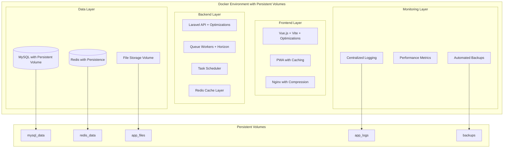
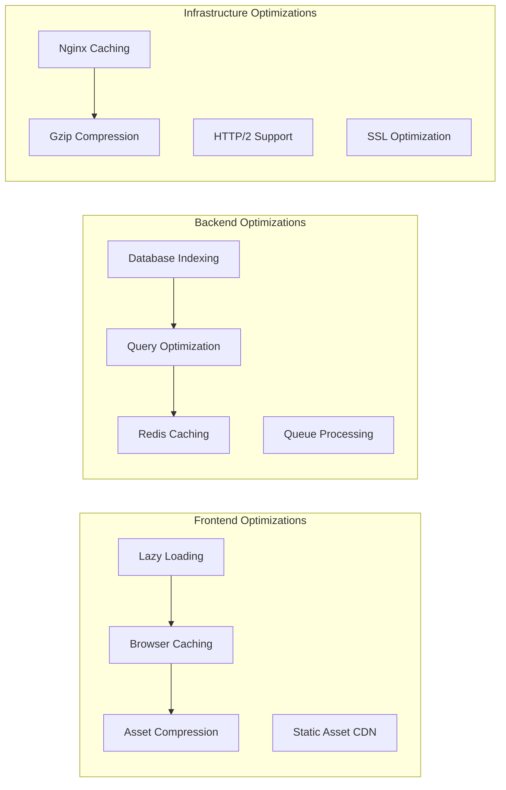

# Design Document

## Overview

This design document outlines the comprehensive solution for fixing critical production issues in the bilingual jewelry platform. The solution addresses data persistence problems, performance bottlenecks, non-functional features, missing enterprise capabilities, and security concerns while maintaining the Docker-based architecture.

The design follows a systematic approach: first establishing data persistence and performance foundations, then implementing functional features with real APIs, adding enterprise-level capabilities, ensuring cross-module integration, and finally implementing security and deployment procedures.

## Architecture

### Enhanced Docker Architecture with Persistent Storage



### Performance Optimization Architecture



## Components and Interfaces

### 1. Data Persistence Layer

#### Docker Volume Configuration
```yaml
# Enhanced docker-compose.yml with persistent volumes
version: '3.8'
services:
  mysql:
    image: mysql:8.0
    volumes:
      - mysql_data:/var/lib/mysql
      - ./docker/mysql/conf.d:/etc/mysql/conf.d
    environment:
      MYSQL_ROOT_PASSWORD: ${DB_PASSWORD}
      MYSQL_DATABASE: ${DB_DATABASE}
    restart: unless-stopped
    
  redis:
    image: redis:7-alpine
    volumes:
      - redis_data:/data
    command: redis-server --appendonly yes --maxmemory 256mb
    restart: unless-stopped
    
  app:
    volumes:
      - app_files:/var/www/html/storage
      - app_logs:/var/www/html/storage/logs
      - backup_data:/var/www/html/backups

volumes:
  mysql_data:
    driver: local
  redis_data:
    driver: local
  app_files:
    driver: local
  app_logs:
    driver: local
  backup_data:
    driver: local
```

#### Database Optimization Configuration
```sql
-- MySQL optimization settings
[mysqld]
innodb_buffer_pool_size = 256M
innodb_log_file_size = 64M
innodb_flush_log_at_trx_commit = 2
query_cache_type = 1
query_cache_size = 32M
max_connections = 100
```

### 2. Performance Optimization Layer

#### Backend Performance Enhancements
```php
// Database Query Optimization Service
class QueryOptimizationService
{
    public function optimizeInventoryQueries()
    {
        // Add composite indexes
        Schema::table('inventory_items', function (Blueprint $table) {
            $table->index(['category_id', 'location_id', 'status']);
            $table->index(['created_at', 'updated_at']);
            $table->index(['gold_purity', 'weight']);
        });
    }
    
    public function implementCaching()
    {
        // Cache frequently accessed data
        Cache::remember('dashboard_kpis', 300, function () {
            return $this->calculateKPIs();
        });
        
        Cache::remember('category_hierarchy', 3600, function () {
            return Category::with('children')->whereNull('parent_id')->get();
        });
    }
}
```

#### Frontend Performance Enhancements
```typescript
// Lazy loading implementation
const LazyDashboard = defineAsyncComponent(() => import('@/views/DashboardView.vue'))
const LazyInventory = defineAsyncComponent(() => import('@/views/InventoryView.vue'))
const LazyInvoices = defineAsyncComponent(() => import('@/views/InvoicesView.vue'))

// Pagination and virtual scrolling
interface PaginationConfig {
  page: number
  perPage: number
  total: number
}

class VirtualScrollService {
  implementVirtualScrolling(items: any[], containerHeight: number) {
    // Virtual scrolling for large datasets
    const itemHeight = 60
    const visibleItems = Math.ceil(containerHeight / itemHeight)
    return items.slice(0, visibleItems + 10) // Buffer items
  }
}
```

### 3. Real API Implementation Layer

#### Invoice System with Real Data
```php
class InvoiceService
{
    public function createInvoice(array $data): Invoice
    {
        DB::transaction(function () use ($data) {
            // Create invoice with real data
            $invoice = Invoice::create([
                'customer_id' => $data['customer_id'],
                'invoice_number' => $this->generateInvoiceNumber(),
                'issue_date' => now(),
                'due_date' => now()->addDays(30),
                'language' => $data['language'] ?? 'en',
                'status' => 'draft'
            ]);
            
            // Add real invoice items
            foreach ($data['items'] as $item) {
                $inventoryItem = InventoryItem::findOrFail($item['inventory_item_id']);
                
                $invoice->items()->create([
                    'inventory_item_id' => $inventoryItem->id,
                    'description' => $inventoryItem->name,
                    'quantity' => $item['quantity'],
                    'unit_price' => $inventoryItem->unit_price,
                    'total_price' => $item['quantity'] * $inventoryItem->unit_price,
                    'gold_purity' => $inventoryItem->gold_purity,
                    'weight' => $inventoryItem->weight
                ]);
                
                // Update inventory
                $inventoryItem->decrement('quantity', $item['quantity']);
            }
            
            // Calculate totals
            $this->calculateInvoiceTotals($invoice);
            
            return $invoice;
        });
    }
    
    public function generatePDF(Invoice $invoice): string
    {
        $template = $invoice->template ?? InvoiceTemplate::default();
        $customer = $invoice->customer;
        
        $pdf = PDF::loadView('invoices.pdf.' . $invoice->language, [
            'invoice' => $invoice->load('items.inventoryItem'),
            'customer' => $customer,
            'template' => $template,
            'business' => BusinessConfiguration::current()
        ]);
        
        $filename = "invoice_{$invoice->invoice_number}.pdf";
        $path = storage_path("app/invoices/{$filename}");
        $pdf->save($path);
        
        return $path;
    }
}
```

#### Batch Operations Implementation
```php
class BatchOperationService
{
    public function processBatchInvoices(array $customerIds, array $options): BatchResult
    {
        $results = [];
        $errors = [];
        
        DB::transaction(function () use ($customerIds, $options, &$results, &$errors) {
            foreach ($customerIds as $customerId) {
                try {
                    $customer = Customer::findOrFail($customerId);
                    
                    // Get pending orders or create from template
                    $invoiceData = $this->prepareInvoiceData($customer, $options);
                    
                    $invoice = $this->invoiceService->createInvoice($invoiceData);
                    
                    if ($options['generate_pdf']) {
                        $pdfPath = $this->invoiceService->generatePDF($invoice);
                        $invoice->update(['pdf_path' => $pdfPath]);
                    }
                    
                    if ($options['send_immediately']) {
                        $this->communicationService->sendInvoice($invoice);
                    }
                    
                    $results[] = [
                        'customer_id' => $customerId,
                        'invoice_id' => $invoice->id,
                        'status' => 'success'
                    ];
                    
                } catch (Exception $e) {
                    $errors[] = [
                        'customer_id' => $customerId,
                        'error' => $e->getMessage()
                    ];
                }
            }
        });
        
        return new BatchResult($results, $errors);
    }
}
```

### 4. Enterprise Reporting System

#### Report Generation Architecture
```php
class EnterpriseReportService
{
    protected array $reportTypes = [
        'sales' => SalesReportGenerator::class,
        'inventory' => InventoryReportGenerator::class,
        'financial' => FinancialReportGenerator::class,
        'customer' => CustomerReportGenerator::class,
        'tax' => TaxReportGenerator::class
    ];
    
    public function generateReport(string $type, array $parameters): Report
    {
        $generator = app($this->reportTypes[$type]);
        
        return $generator
            ->setDateRange($parameters['date_range'])
            ->setFilters($parameters['filters'])
            ->setLanguage($parameters['language'])
            ->setFormat($parameters['format'])
            ->generate();
    }
}

class SalesReportGenerator extends BaseReportGenerator
{
    public function generate(): Report
    {
        $data = $this->getSalesData();
        $charts = $this->generateCharts($data);
        $summary = $this->calculateSummary($data);
        
        return new Report([
            'title' => __('reports.sales_report'),
            'data' => $data,
            'charts' => $charts,
            'summary' => $summary,
            'generated_at' => now(),
            'language' => $this->language
        ]);
    }
    
    protected function getSalesData(): Collection
    {
        return Invoice::with(['customer', 'items.inventoryItem'])
            ->whereBetween('issue_date', $this->dateRange)
            ->when($this->filters['customer_id'] ?? null, function ($query, $customerId) {
                $query->where('customer_id', $customerId);
            })
            ->when($this->filters['category_id'] ?? null, function ($query, $categoryId) {
                $query->whereHas('items.inventoryItem', function ($q) use ($categoryId) {
                    $q->where('category_id', $categoryId);
                });
            })
            ->get();
    }
}
```

#### Frontend Report Interface
```vue
<template>
  <div class="reports-container">
    <div class="report-tabs">
      <button 
        v-for="category in reportCategories" 
        :key="category.id"
        @click="activeCategory = category.id"
        :class="{ active: activeCategory === category.id }"
      >
        {{ $t(`reports.${category.name}`) }}
      </button>
    </div>
    
    <div class="report-content">
      <ReportFilters 
        v-model="filters" 
        :category="activeCategory"
        @generate="generateReport"
      />
      
      <ReportDisplay 
        :report="currentReport"
        :loading="loading"
        @export="exportReport"
        @schedule="scheduleReport"
      />
    </div>
  </div>
</template>

<script setup lang="ts">
const reportCategories = [
  { id: 'sales', name: 'sales_reports' },
  { id: 'inventory', name: 'inventory_reports' },
  { id: 'financial', name: 'financial_reports' },
  { id: 'customer', name: 'customer_reports' },
  { id: 'tax', name: 'tax_reports' }
]

const generateReport = async () => {
  loading.value = true
  try {
    const response = await api.post('/reports/generate', {
      type: activeCategory.value,
      parameters: filters.value
    })
    currentReport.value = response.data
  } finally {
    loading.value = false
  }
}
</script>
```

### 5. Enhanced Enterprise Accounting

#### Advanced Accounting Features
```php
class EnterpriseAccountingService
{
    public function createChartOfAccounts(): void
    {
        $accounts = [
            // Assets
            ['code' => '1000', 'name' => 'Current Assets', 'type' => 'asset', 'parent_id' => null],
            ['code' => '1100', 'name' => 'Cash and Cash Equivalents', 'type' => 'asset', 'parent_id' => 1],
            ['code' => '1200', 'name' => 'Accounts Receivable', 'type' => 'asset', 'parent_id' => 1],
            ['code' => '1300', 'name' => 'Inventory', 'type' => 'asset', 'parent_id' => 1],
            
            // Fixed Assets
            ['code' => '1500', 'name' => 'Fixed Assets', 'type' => 'asset', 'parent_id' => null],
            ['code' => '1510', 'name' => 'Equipment', 'type' => 'asset', 'parent_id' => 5],
            ['code' => '1520', 'name' => 'Accumulated Depreciation', 'type' => 'asset', 'parent_id' => 5],
            
            // Liabilities
            ['code' => '2000', 'name' => 'Current Liabilities', 'type' => 'liability', 'parent_id' => null],
            ['code' => '2100', 'name' => 'Accounts Payable', 'type' => 'liability', 'parent_id' => 7],
            ['code' => '2200', 'name' => 'Accrued Expenses', 'type' => 'liability', 'parent_id' => 7],
            
            // Equity
            ['code' => '3000', 'name' => 'Owner\'s Equity', 'type' => 'equity', 'parent_id' => null],
            ['code' => '3100', 'name' => 'Retained Earnings', 'type' => 'equity', 'parent_id' => 10],
            
            // Revenue
            ['code' => '4000', 'name' => 'Revenue', 'type' => 'revenue', 'parent_id' => null],
            ['code' => '4100', 'name' => 'Sales Revenue', 'type' => 'revenue', 'parent_id' => 12],
            
            // Expenses
            ['code' => '5000', 'name' => 'Cost of Goods Sold', 'type' => 'expense', 'parent_id' => null],
            ['code' => '6000', 'name' => 'Operating Expenses', 'type' => 'expense', 'parent_id' => null],
        ];
        
        foreach ($accounts as $account) {
            Account::create($account);
        }
    }
    
    public function processJournalEntry(array $entries): Transaction
    {
        $totalDebits = collect($entries)->sum('debit_amount');
        $totalCredits = collect($entries)->sum('credit_amount');
        
        if ($totalDebits !== $totalCredits) {
            throw new AccountingException('Journal entry must balance');
        }
        
        return DB::transaction(function () use ($entries) {
            $transaction = Transaction::create([
                'reference_number' => $this->generateReferenceNumber(),
                'description' => $entries[0]['description'],
                'transaction_date' => now(),
                'type' => 'journal_entry'
            ]);
            
            foreach ($entries as $entry) {
                $transaction->entries()->create([
                    'account_id' => $entry['account_id'],
                    'debit_amount' => $entry['debit_amount'] ?? 0,
                    'credit_amount' => $entry['credit_amount'] ?? 0,
                    'description' => $entry['description']
                ]);
            }
            
            return $transaction;
        });
    }
    
    public function calculateDepreciation(Asset $asset): float
    {
        $method = $asset->depreciation_method;
        $cost = $asset->cost;
        $salvageValue = $asset->salvage_value;
        $usefulLife = $asset->useful_life_years;
        $currentAge = $asset->created_at->diffInYears(now());
        
        switch ($method) {
            case 'straight_line':
                return ($cost - $salvageValue) / $usefulLife;
            case 'declining_balance':
                $rate = 2 / $usefulLife;
                return $cost * pow(1 - $rate, $currentAge) * $rate;
            default:
                return 0;
        }
    }
}
```

### 6. Cross-Module Integration

#### Integration Event System
```php
class IntegrationEventService
{
    public function handleInvoiceCreated(Invoice $invoice): void
    {
        // Update inventory
        foreach ($invoice->items as $item) {
            $this->inventoryService->updateStock(
                $item->inventory_item_id,
                -$item->quantity,
                'sale',
                "Invoice #{$invoice->invoice_number}"
            );
        }
        
        // Create accounting entries
        $this->accountingService->createSaleEntries($invoice);
        
        // Update customer statistics
        $this->customerService->updatePurchaseHistory($invoice->customer_id, $invoice);
        
        // Trigger notifications
        event(new InvoiceCreatedEvent($invoice));
    }
    
    public function handleInventoryAdjustment(InventoryMovement $movement): void
    {
        // Create accounting entry for inventory adjustment
        $this->accountingService->createInventoryAdjustmentEntry($movement);
        
        // Update item valuation
        $this->inventoryService->recalculateItemValuation($movement->inventory_item_id);
        
        // Check for reorder alerts
        $this->alertService->checkReorderLevels($movement->inventory_item_id);
    }
}
```

### 7. Security Implementation

#### Minimal Security Configuration
```php
// config/cors.php - Simplified CORS
return [
    'paths' => ['api/*', 'sanctum/csrf-cookie'],
    'allowed_methods' => ['*'],
    'allowed_origins' => [
        env('FRONTEND_URL', 'http://localhost:3000'),
        env('APP_URL', 'http://localhost:8000')
    ],
    'allowed_origins_patterns' => [],
    'allowed_headers' => ['*'],
    'exposed_headers' => [],
    'max_age' => 0,
    'supports_credentials' => true,
];

// Middleware configuration
class SecurityMiddleware
{
    public function handle($request, Closure $next)
    {
        // Simple rate limiting
        if ($this->isExceedingRateLimit($request)) {
            return response()->json(['error' => 'Too many requests'], 429);
        }
        
        // Basic input sanitization
        $this->sanitizeInput($request);
        
        return $next($request);
    }
    
    protected function isExceedingRateLimit($request): bool
    {
        $key = 'rate_limit:' . $request->ip();
        $attempts = Cache::get($key, 0);
        
        if ($attempts >= 100) { // 100 requests per minute
            return true;
        }
        
        Cache::put($key, $attempts + 1, 60);
        return false;
    }
}
```

## Data Models

### Enhanced Models with Performance Optimizations

```php
class Invoice extends Model
{
    protected $with = ['customer']; // Eager load by default
    
    protected $casts = [
        'issue_date' => 'date',
        'due_date' => 'date',
        'subtotal' => 'decimal:2',
        'tax_amount' => 'decimal:2',
        'total_amount' => 'decimal:2',
        'is_paid' => 'boolean'
    ];
    
    // Optimized scopes
    public function scopeRecent($query)
    {
        return $query->where('created_at', '>=', now()->subDays(30));
    }
    
    public function scopeByStatus($query, $status)
    {
        return $query->where('status', $status);
    }
    
    // Calculated attributes
    public function getIsOverdueAttribute(): bool
    {
        return $this->due_date < now() && $this->status !== 'paid';
    }
}

class InventoryItem extends Model
{
    protected $casts = [
        'quantity' => 'decimal:3',
        'unit_price' => 'decimal:2',
        'cost_price' => 'decimal:2',
        'gold_purity' => 'decimal:3',
        'weight' => 'decimal:3',
        'is_active' => 'boolean'
    ];
    
    // Performance indexes
    public function getTable()
    {
        return 'inventory_items';
    }
    
    // Optimized relationships
    public function category()
    {
        return $this->belongsTo(Category::class)->select(['id', 'name', 'image_path']);
    }
    
    public function location()
    {
        return $this->belongsTo(Location::class)->select(['id', 'name']);
    }
}
```

## Error Handling

### Comprehensive Error Management
```php
class GlobalExceptionHandler extends Handler
{
    public function render($request, Throwable $exception)
    {
        if ($request->expectsJson()) {
            return $this->handleApiException($exception);
        }
        
        return parent::render($request, $exception);
    }
    
    protected function handleApiException(Throwable $exception): JsonResponse
    {
        $status = 500;
        $message = 'Internal Server Error';
        
        if ($exception instanceof ValidationException) {
            $status = 422;
            $message = 'Validation Error';
        } elseif ($exception instanceof ModelNotFoundException) {
            $status = 404;
            $message = 'Resource Not Found';
        } elseif ($exception instanceof AuthenticationException) {
            $status = 401;
            $message = 'Unauthorized';
        }
        
        return response()->json([
            'success' => false,
            'message' => $message,
            'errors' => $this->getErrorDetails($exception),
            'timestamp' => now()->toISOString()
        ], $status);
    }
}
```

## Testing Strategy

### Performance Testing
```php
class PerformanceTest extends TestCase
{
    public function test_dashboard_loads_within_time_limit()
    {
        $start = microtime(true);
        
        $response = $this->actingAs($this->user)
            ->get('/api/dashboard/kpis');
        
        $duration = microtime(true) - $start;
        
        $response->assertStatus(200);
        $this->assertLessThan(0.5, $duration, 'Dashboard should load within 500ms');
    }
    
    public function test_large_invoice_list_pagination()
    {
        Invoice::factory(1000)->create();
        
        $response = $this->get('/api/invoices?page=1&per_page=50');
        
        $response->assertStatus(200)
            ->assertJsonStructure([
                'data',
                'meta' => ['current_page', 'per_page', 'total']
            ]);
    }
}
```

This comprehensive design addresses all the critical issues identified in the requirements while maintaining the Docker-based architecture and ensuring enterprise-level performance and functionality.