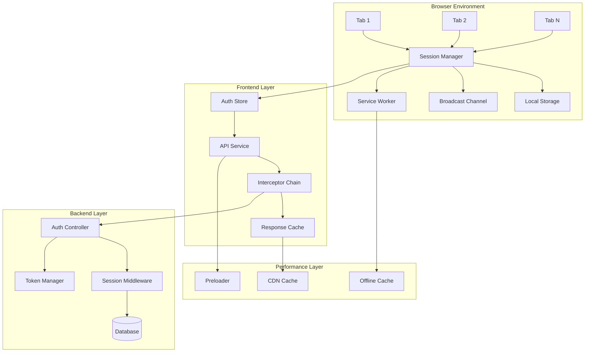

# Design Document

## Overview

This design addresses the critical authentication and performance issues affecting user experience when switching between tabs. The solution implements a comprehensive approach to session persistence, performance optimization, and reliable logout functionality while maintaining security best practices.

The design leverages the existing Laravel Sanctum authentication system and Vue.js frontend architecture, enhancing them with cross-tab session synchronization, intelligent caching, and optimized loading strategies.

## Architecture

### High-Level Architecture



### Session Persistence Architecture

The session persistence system uses multiple layers to ensure seamless authentication across tabs:

1. **Cross-Tab Communication**: Broadcast Channel API for real-time session state synchronization
2. **Persistent Storage**: Enhanced localStorage with session metadata
3. **Token Management**: Intelligent token refresh with conflict resolution
4. **Session Validation**: Background validation with automatic recovery

## Components and Interfaces

### 1. Cross-Tab Session Manager

**Purpose**: Manages authentication state synchronization across browser tabs

**Key Features**:
- Real-time session state broadcasting
- Conflict resolution for simultaneous operations
- Automatic session recovery
- Tab lifecycle management

**Interface**:
```typescript
interface CrossTabSessionManager {
  // Session synchronization
  broadcastSessionUpdate(sessionData: SessionData): void;
  subscribeToSessionUpdates(callback: (data: SessionData) => void): void;
  
  // Tab management
  registerTab(tabId: string): void;
  unregisterTab(tabId: string): void;
  getActiveTabs(): string[];
  
  // Session coordination
  requestSessionLock(operation: string): Promise<boolean>;
  releaseSessionLock(operation: string): void;
  
  // Recovery mechanisms
  detectSessionConflicts(): Promise<ConflictResolution>;
  recoverFromConflict(resolution: ConflictResolution): Promise<void>;
}
```

### 2. Enhanced Authentication Store

**Purpose**: Centralized authentication state management with cross-tab awareness

**Key Enhancements**:
- Cross-tab session synchronization
- Intelligent retry mechanisms
- Session conflict resolution
- Performance-optimized state updates

**Interface Extensions**:
```typescript
interface EnhancedAuthStore extends AuthStore {
  // Cross-tab features
  syncWithOtherTabs(): Promise<void>;
  handleCrossTabLogout(): Promise<void>;
  resolveSessionConflict(conflictData: ConflictData): Promise<void>;
  
  // Performance features
  preloadUserData(): Promise<void>;
  getCachedUserData(): User | null;
  invalidateCache(): void;
  
  // Session management
  getSessionHealth(): SessionHealth;
  performHealthCheck(): Promise<boolean>;
  scheduleSessionMaintenance(): void;
}
```

### 3. Performance-Optimized API Service

**Purpose**: High-performance API communication with intelligent caching and retry logic

**Key Features**:
- Response caching with TTL management
- Request deduplication
- Intelligent retry with exponential backoff
- Performance monitoring and metrics

**Interface**:
```typescript
interface PerformanceApiService extends ApiService {
  // Caching features
  setCacheStrategy(endpoint: string, strategy: CacheStrategy): void;
  getCachedResponse<T>(key: string): Promise<T | null>;
  invalidateCache(pattern: string): void;
  
  // Performance features
  enableRequestDeduplication(enabled: boolean): void;
  setPerformanceThresholds(thresholds: PerformanceThresholds): void;
  getPerformanceMetrics(): PerformanceMetrics;
  
  // Retry mechanisms
  configureRetryPolicy(policy: RetryPolicy): void;
  getRetryStatistics(): RetryStatistics;
}
```

### 4. Tab Loading Optimizer

**Purpose**: Optimizes tab loading performance through intelligent preloading and caching

**Key Features**:
- Route-based preloading
- Component lazy loading
- Resource prioritization
- Loading state management

**Interface**:
```typescript
interface TabLoadingOptimizer {
  // Preloading
  preloadRoute(route: string): Promise<void>;
  preloadCriticalResources(): Promise<void>;
  schedulePreloading(routes: string[]): void;
  
  // Loading optimization
  optimizeComponentLoading(component: string): Promise<void>;
  prioritizeResources(resources: Resource[]): void;
  
  // Performance monitoring
  measureLoadingTime(tabId: string): Promise<LoadingMetrics>;
  getLoadingStatistics(): LoadingStatistics;
}
```

### 5. Reliable Logout Manager

**Purpose**: Ensures consistent and reliable logout functionality across all tabs

**Key Features**:
- Cross-tab logout coordination
- Token cleanup verification
- Session invalidation confirmation
- Fallback mechanisms for failed logouts

**Interface**:
```typescript
interface ReliableLogoutManager {
  // Logout coordination
  initiateLogout(): Promise<LogoutResult>;
  broadcastLogout(): void;
  confirmLogoutCompletion(): Promise<boolean>;
  
  // Cleanup operations
  clearAllTokens(): Promise<void>;
  clearSessionData(): Promise<void>;
  clearCachedData(): Promise<void>;
  
  // Verification
  verifyLogoutSuccess(): Promise<boolean>;
  handleLogoutFailure(error: LogoutError): Promise<void>;
}
```

## Data Models

### Session Data Model

```typescript
interface SessionData {
  sessionId: string;
  userId: number;
  token: string;
  expiresAt: Date;
  lastActivity: Date;
  tabId: string;
  isActive: boolean;
  metadata: {
    userAgent: string;
    ipAddress: string;
    loginTime: Date;
    refreshCount: number;
  };
}
```

### Performance Metrics Model

```typescript
interface PerformanceMetrics {
  tabSwitchTime: number;
  apiResponseTime: number;
  cacheHitRate: number;
  loadingTime: {
    initial: number;
    subsequent: number;
    average: number;
  };
  errorRate: number;
  retryCount: number;
}
```

### Cache Strategy Model

```typescript
interface CacheStrategy {
  ttl: number; // Time to live in milliseconds
  maxSize: number; // Maximum cache size
  strategy: 'lru' | 'fifo' | 'ttl';
  invalidationRules: InvalidationRule[];
  compressionEnabled: boolean;
}
```

## Error Handling

### Authentication Error Recovery

1. **Token Expiry Handling**:
   - Automatic token refresh with conflict resolution
   - Fallback to re-authentication if refresh fails
   - Cross-tab notification of authentication state changes

2. **Network Error Recovery**:
   - Exponential backoff retry mechanism
   - Offline mode detection and handling
   - Queue failed requests for retry when connection restored

3. **Session Conflict Resolution**:
   - Detect simultaneous login attempts across tabs
   - Implement last-writer-wins strategy with user notification
   - Provide manual conflict resolution interface

### Performance Error Handling

1. **Loading Timeout Management**:
   - Progressive timeout increases for slow connections
   - Fallback to cached data when available
   - User notification for extended loading times

2. **Cache Corruption Recovery**:
   - Automatic cache validation and cleanup
   - Fallback to fresh API calls when cache is invalid
   - Cache rebuilding strategies

### Logout Error Handling

1. **Backend Logout Failure**:
   - Continue with local cleanup even if backend fails
   - Retry backend logout in background
   - Log security events for audit purposes

2. **Cross-Tab Logout Coordination**:
   - Handle unresponsive tabs gracefully
   - Implement timeout mechanisms for tab coordination
   - Ensure logout completion even with partial failures

## Testing Strategy

### Unit Testing Approach

1. **Authentication Components**:
   - Test session synchronization logic
   - Verify token refresh mechanisms
   - Validate error handling scenarios
   - Test cross-tab communication

2. **Performance Components**:
   - Test caching strategies and invalidation
   - Verify loading optimization algorithms
   - Test retry mechanisms and backoff strategies
   - Validate performance metric collection

3. **Integration Points**:
   - Test API service integration
   - Verify Docker environment compatibility
   - Test real database interactions
   - Validate end-to-end authentication flows

### End-to-End Testing with Playwright MCP

1. **Cross-Tab Authentication Testing**:
   - Open multiple tabs and verify session persistence
   - Test tab switching without re-authentication
   - Verify logout propagation across tabs
   - Test session recovery after browser restart

2. **Performance Testing**:
   - Measure tab switching times (target: <500ms)
   - Test loading performance under various conditions
   - Verify cache effectiveness
   - Test performance under high load

3. **Error Scenario Testing**:
   - Test network disconnection and recovery
   - Test server errors and retry mechanisms
   - Test concurrent login attempts
   - Test logout functionality under various conditions

### Docker Environment Testing

1. **Container Integration**:
   - Test authentication in Docker environment
   - Verify session persistence across container restarts
   - Test network connectivity and CORS handling
   - Validate environment variable configuration

2. **Real Application Testing**:
   - Use actual web application instead of mocks
   - Test with real database connections
   - Verify production-like environment behavior
   - Test with actual user credentials (test@example.com/password)

### Test Data and Scenarios

1. **Authentication Test Scenarios**:
   - Valid login with session persistence
   - Invalid credentials handling
   - Session expiry and refresh
   - Cross-tab logout verification
   - Concurrent session management

2. **Performance Test Scenarios**:
   - Fast network conditions (target: <200ms tab switch)
   - Slow network conditions (target: <500ms tab switch)
   - Offline/online transitions
   - High concurrent user load
   - Large dataset handling

3. **Error Recovery Test Scenarios**:
   - Network interruption during authentication
   - Server errors during session validation
   - Browser crash and recovery
   - Partial logout failures
   - Cache corruption scenarios

## Security Considerations

### Session Security

1. **Token Management**:
   - Secure token storage with encryption
   - Token rotation on suspicious activity
   - Cross-tab token synchronization security
   - Token cleanup on logout

2. **Cross-Tab Communication Security**:
   - Validate message origins
   - Encrypt sensitive data in broadcasts
   - Implement message authentication
   - Rate limiting for cross-tab messages

### Performance Security

1. **Cache Security**:
   - Encrypt sensitive cached data
   - Implement cache access controls
   - Secure cache invalidation
   - Prevent cache poisoning attacks

2. **API Security**:
   - Request signing for critical operations
   - Rate limiting per session
   - Request deduplication security
   - Performance monitoring for anomaly detection

## Implementation Phases

### Phase 1: Core Session Management
- Implement cross-tab session synchronization
- Enhance authentication store with cross-tab awareness
- Implement reliable logout functionality
- Basic performance optimizations

### Phase 2: Performance Optimization
- Implement intelligent caching strategies
- Add request deduplication and retry logic
- Optimize tab loading performance
- Add performance monitoring

### Phase 3: Advanced Features
- Implement session conflict resolution
- Add offline mode support
- Enhanced error recovery mechanisms
- Advanced performance analytics

### Phase 4: Testing and Validation
- Comprehensive unit and integration testing
- Playwright MCP end-to-end testing
- Docker environment validation
- Performance benchmarking and optimization