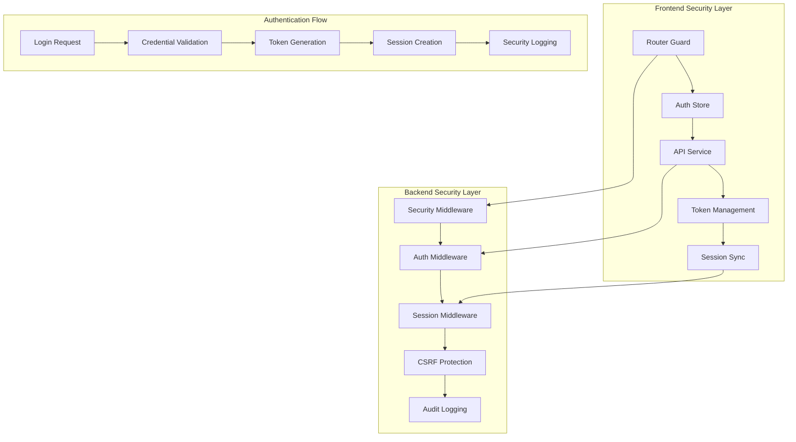

# Security and Authentication Fixes Design

## Overview

This design addresses critical security and authentication issues in the jewelry platform by implementing a robust, reliable authentication system with proper session management, route protection, and comprehensive security measures. The solution focuses on fixing the current authentication bypass, stabilizing session management, and ensuring reliable login processes while maintaining the existing minimal security approach.

## Architecture

### Current State Analysis

**Problems Identified:**
1. **Router Authentication Bypass**: Navigation guard is disabled with temporary comment
2. **Session Management Conflicts**: Frontend and backend session timeouts are not synchronized
3. **Unreliable Login Process**: Network errors and authentication failures cause multiple retry attempts
4. **Inconsistent Security Enforcement**: Some routes accessible without authentication
5. **Poor Error Handling**: Authentication errors don't provide clear feedback

**Existing Security Infrastructure:**
- Laravel Sanctum for API authentication
- Basic security middleware (CORS, CSRF, rate limiting)
- Session security middleware with timeout handling
- Security audit logging
- Input sanitization and validation

### Target Architecture



## Components and Interfaces

### 1. Enhanced Authentication Controller

**Purpose**: Provide reliable authentication endpoints with proper error handling

**Key Features**:
- Retry logic for network failures
- Detailed error responses with actionable messages
- Session synchronization between frontend and backend
- Enhanced security logging

**Interface**:
```php
class AuthController extends Controller
{
    public function login(Request $request): JsonResponse
    public function logout(Request $request): JsonResponse
    public function refresh(Request $request): JsonResponse
    public function user(Request $request): JsonResponse
    public function validateSession(Request $request): JsonResponse
}
```

### 2. Frontend Authentication Store Enhancement

**Purpose**: Manage authentication state with reliable session handling

**Key Features**:
- Automatic token refresh
- Session timeout synchronization
- Activity tracking
- Graceful error handling
- Retry mechanisms for failed requests

**Interface**:
```typescript
interface AuthStore {
  // State
  user: User | null
  token: string | null
  isAuthenticated: boolean
  sessionExpiry: Date | null
  
  // Actions
  login(credentials: LoginCredentials): Promise<AuthResult>
  logout(): Promise<void>
  refreshToken(): Promise<boolean>
  validateSession(): Promise<boolean>
  syncSessionTimeout(): Promise<void>
}
```

### 3. Enhanced Router Guard

**Purpose**: Protect routes with reliable authentication checks

**Key Features**:
- Pre-route authentication validation
- Session expiry checks
- Redirect handling with return URLs
- Loading states during authentication checks

**Implementation**:
```typescript
router.beforeEach(async (to, from, next) => {
  const authStore = useAuthStore()
  
  // Initialize auth if needed
  if (!authStore.initialized) {
    await authStore.initialize()
  }
  
  // Check route protection requirements
  const requiresAuth = to.matched.some(record => record.meta.requiresAuth)
  
  if (requiresAuth) {
    // Validate current session
    const isValid = await authStore.validateSession()
    
    if (!isValid) {
      // Store intended destination
      const returnUrl = to.fullPath
      next(`/login?returnUrl=${encodeURIComponent(returnUrl)}`)
      return
    }
  }
  
  next()
})
```

### 4. Session Synchronization Service

**Purpose**: Keep frontend and backend session states synchronized

**Key Features**:
- Periodic session validation
- Automatic session extension
- Timeout warning notifications
- Graceful session expiry handling

**Interface**:
```typescript
interface SessionSyncService {
  startSync(): void
  stopSync(): void
  validateSession(): Promise<boolean>
  extendSession(): Promise<boolean>
  handleExpiry(): void
}
```

### 5. Enhanced API Service

**Purpose**: Provide reliable API communication with proper error handling

**Key Features**:
- Automatic token refresh
- Request retry with exponential backoff
- Enhanced error categorization
- Session-aware request handling

**Enhancements**:
```typescript
// Request interceptor with retry logic
api.interceptors.request.use(async (config) => {
  // Add authentication headers
  const token = await getValidToken()
  if (token) {
    config.headers.Authorization = `Bearer ${token}`
  }
  
  // Add retry configuration
  config.metadata = { retryCount: 0 }
  
  return config
})

// Response interceptor with retry logic
api.interceptors.response.use(
  response => response,
  async (error) => {
    const config = error.config
    
    // Handle authentication errors
    if (error.response?.status === 401) {
      const refreshed = await refreshToken()
      if (refreshed && config.metadata.retryCount < 3) {
        config.metadata.retryCount++
        return api.request(config)
      }
    }
    
    // Handle network errors with retry
    if (!error.response && config.metadata.retryCount < 3) {
      config.metadata.retryCount++
      await delay(Math.pow(2, config.metadata.retryCount) * 1000)
      return api.request(config)
    }
    
    return Promise.reject(error)
  }
)
```

## Data Models

### Authentication State Model

```typescript
interface AuthState {
  user: User | null
  token: string | null
  refreshToken: string | null
  sessionExpiry: Date | null
  lastActivity: Date
  isLoading: boolean
  error: string | null
  initialized: boolean
}

interface User {
  id: number
  name: string
  email: string
  role: string
  preferred_language: string
  is_active: boolean
  last_login_at: string
  session_timeout: number // in minutes
}

interface LoginCredentials {
  email: string
  password: string
  remember?: boolean
}

interface AuthResult {
  success: boolean
  error?: string
  requiresTwoFactor?: boolean
}
```

### Session Management Model

```typescript
interface SessionInfo {
  id: string
  userId: number
  expiresAt: Date
  lastActivity: Date
  ipAddress: string
  userAgent: string
  isActive: boolean
}

interface SessionConfig {
  timeout: number // minutes
  warningTime: number // minutes before expiry
  extendOnActivity: boolean
  maxInactivity: number // minutes
}
```

## Error Handling

### Authentication Error Categories

1. **Network Errors**
   - Connection timeouts
   - DNS resolution failures
   - Server unavailable
   - **Handling**: Automatic retry with exponential backoff

2. **Authentication Errors**
   - Invalid credentials
   - Account locked/disabled
   - Token expired/invalid
   - **Handling**: Clear error messages, logout if necessary

3. **Session Errors**
   - Session expired
   - Session invalid
   - Concurrent session limit
   - **Handling**: Graceful logout with return URL preservation

4. **Authorization Errors**
   - Insufficient permissions
   - Resource access denied
   - **Handling**: Redirect to appropriate page with error message

### Error Response Format

```typescript
interface ApiError {
  success: false
  error: {
    code: string
    message: string
    details?: any
    retryable?: boolean
  }
}
```

### Frontend Error Handling Strategy

```typescript
class AuthErrorHandler {
  handle(error: ApiError): void {
    switch (error.error.code) {
      case 'NETWORK_ERROR':
        this.handleNetworkError(error)
        break
      case 'INVALID_CREDENTIALS':
        this.handleCredentialError(error)
        break
      case 'SESSION_EXPIRED':
        this.handleSessionExpired(error)
        break
      case 'TOKEN_EXPIRED':
        this.handleTokenExpired(error)
        break
      default:
        this.handleGenericError(error)
    }
  }
}
```

## Testing Strategy

### Unit Tests

1. **Authentication Store Tests**
   - Login/logout functionality
   - Token refresh logic
   - Session timeout handling
   - Error state management

2. **API Service Tests**
   - Request/response interceptors
   - Retry logic
   - Error handling
   - Token management

3. **Router Guard Tests**
   - Route protection
   - Redirect logic
   - Authentication checks
   - Return URL handling

### Integration Tests

1. **Authentication Flow Tests**
   - Complete login/logout cycle
   - Session management
   - Route protection
   - Error scenarios

2. **Session Synchronization Tests**
   - Frontend/backend sync
   - Timeout handling
   - Activity tracking
   - Expiry notifications

### End-to-End Tests

1. **User Journey Tests**
   - Login process reliability
   - Protected route access
   - Session timeout behavior
   - Error recovery

2. **Security Tests**
   - Unauthorized access attempts
   - Token manipulation
   - Session hijacking prevention
   - CSRF protection

### Performance Tests

1. **Authentication Performance**
   - Login response times
   - Token refresh speed
   - Session validation performance

2. **Concurrent Session Tests**
   - Multiple user sessions
   - Session cleanup
   - Memory usage

## Security Considerations

### Authentication Security

1. **Token Security**
   - Secure token storage
   - Token rotation
   - Expiry management
   - Revocation handling

2. **Session Security**
   - Session fixation prevention
   - Concurrent session limits
   - Activity monitoring
   - Secure session storage

### Frontend Security

1. **XSS Prevention**
   - Input sanitization
   - Content Security Policy
   - Secure token handling

2. **CSRF Protection**
   - Token validation
   - SameSite cookies
   - Origin verification

### Backend Security

1. **API Security**
   - Rate limiting
   - Input validation
   - SQL injection prevention
   - Authorization checks

2. **Audit Logging**
   - Authentication events
   - Security violations
   - Session activities
   - Error tracking

## Configuration Management

### Environment Variables

```env
# Authentication Configuration
AUTH_TOKEN_LIFETIME=60
AUTH_REFRESH_LIFETIME=1440
AUTH_SESSION_TIMEOUT=30
AUTH_MAX_LOGIN_ATTEMPTS=5
AUTH_LOCKOUT_DURATION=15

# Security Configuration
SECURITY_CSRF_ENABLED=true
SECURITY_RATE_LIMIT=100
SECURITY_SESSION_REGENERATE=30
SECURITY_AUDIT_ENABLED=true

# Frontend Configuration
VITE_AUTH_TIMEOUT_WARNING=5
VITE_AUTH_RETRY_ATTEMPTS=3
VITE_AUTH_RETRY_DELAY=1000
```

### Runtime Configuration

```typescript
interface AuthConfig {
  tokenLifetime: number
  sessionTimeout: number
  retryAttempts: number
  retryDelay: number
  warningTime: number
  autoRefresh: boolean
}
```

## Monitoring and Logging

### Authentication Metrics

1. **Success Metrics**
   - Login success rate
   - Session duration
   - Token refresh frequency

2. **Error Metrics**
   - Failed login attempts
   - Session timeouts
   - Network errors
   - Authentication errors

### Security Monitoring

1. **Threat Detection**
   - Brute force attempts
   - Suspicious login patterns
   - Token manipulation attempts

2. **Performance Monitoring**
   - Authentication response times
   - Session validation performance
   - API error rates

### Log Structure

```json
{
  "timestamp": "2025-01-12T10:30:00Z",
  "level": "INFO",
  "event": "authentication",
  "action": "login_success",
  "user_id": 123,
  "ip_address": "192.168.1.100",
  "user_agent": "Mozilla/5.0...",
  "session_id": "sess_abc123",
  "metadata": {
    "login_method": "email_password",
    "remember_me": false,
    "two_factor": false
  }
}
```