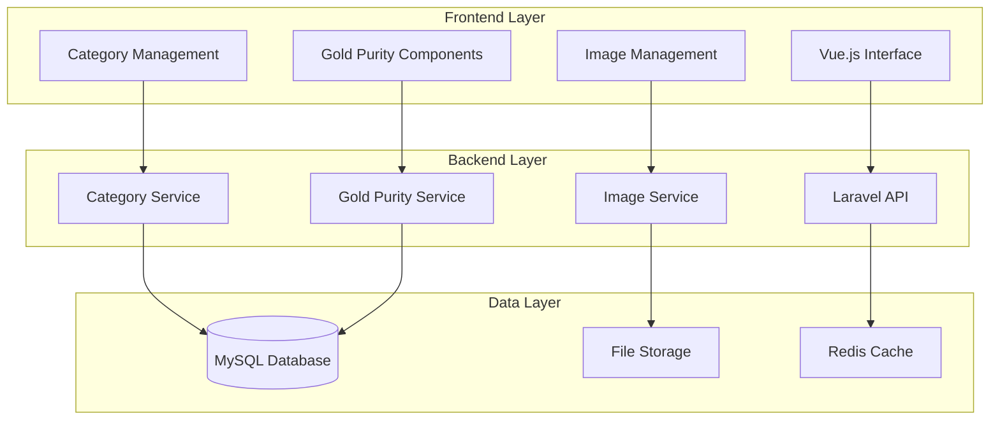

# Jewelry Category Management Documentation

## Overview

This documentation covers the comprehensive jewelry category management system that supports hierarchical categories, gold purity specifications (عیار طلا), image management, and bilingual support for English and Persian languages.

## Documentation Structure

### 📚 User Documentation

#### [User Guide - Category Management](user-guide/category-management.md)
Complete guide for end users covering:
- Getting started with category management
- Creating and managing categories and subcategories
- Gold purity system usage
- Image management
- Bilingual support
- Reporting and analytics
- Troubleshooting common user issues

### 🔧 Technical Documentation

#### [API Documentation - Category Management](api/category-management.md)
Comprehensive API reference covering:
- All category management endpoints
- Request/response formats
- Authentication requirements
- Error handling
- Rate limiting
- Localization support
- Code examples and usage patterns

#### [Gold Purity System Technical Guide](technical/gold-purity-system.md)
In-depth technical documentation for:
- Gold purity system architecture
- Service class implementations
- Frontend components
- Database schema
- Validation and business rules
- Localization and Persian numeral support
- Performance considerations
- Testing strategies

### 🚀 Deployment Documentation

#### [Image Storage Setup Guide](deployment/image-storage-setup.md)
Complete deployment guide covering:
- Docker environment configuration
- Traditional server setup
- Web server configuration (Nginx/Apache)
- File storage and permissions
- Security configuration
- Performance optimization
- Backup and maintenance procedures
- Monitoring and health checks

#### [System Requirements](system-requirements.md)
Detailed system requirements including:
- Hardware specifications
- Software dependencies
- Docker environment requirements
- Network and security requirements
- Storage and performance requirements
- Development environment setup
- Production environment configuration
- Compliance and standards

### 🔍 Troubleshooting Documentation

#### [Category Management Troubleshooting Guide](troubleshooting/category-management-issues.md)
Comprehensive troubleshooting guide covering:
- Database issues and solutions
- Image upload and display problems
- Category hierarchy issues
- Gold purity system problems
- Localization and language issues
- Performance optimization
- Docker-specific issues
- Emergency recovery procedures

## Quick Start Guide

### For Users
1. Read the [User Guide](user-guide/category-management.md) to understand the interface
2. Start with creating main categories for your jewelry types
3. Add subcategories and set gold purity defaults
4. Upload category images for better visual organization
5. Configure bilingual names if using Persian language

### For Developers
1. Review [System Requirements](system-requirements.md) for setup prerequisites
2. Follow [Image Storage Setup](deployment/image-storage-setup.md) for deployment
3. Reference [API Documentation](api/category-management.md) for integration
4. Study [Gold Purity System](technical/gold-purity-system.md) for customization
5. Use [Troubleshooting Guide](troubleshooting/category-management-issues.md) for issues

### For System Administrators
1. Ensure [System Requirements](system-requirements.md) are met
2. Follow [Image Storage Setup](deployment/image-storage-setup.md) for proper configuration
3. Set up monitoring and backup procedures
4. Review security configurations
5. Keep [Troubleshooting Guide](troubleshooting/category-management-issues.md) handy

## Feature Overview

### Core Features
- **Hierarchical Categories**: Main categories with unlimited subcategories
- **Gold Purity Management**: Karat-based purity system with Persian support
- **Image Management**: Upload, optimize, and manage category images
- **Bilingual Support**: Full English and Persian language support
- **Drag-and-Drop Reordering**: Intuitive category organization
- **Advanced Search**: Search categories in both languages

### Integration Features
- **Inventory Integration**: Seamless integration with inventory management
- **Invoice Integration**: Category information in invoices and reports
- **Reporting**: Category-based analytics and performance reports
- **API Support**: RESTful API for external integrations
- **Docker Support**: Containerized deployment ready

### Technical Features
- **Image Optimization**: Automatic image compression and thumbnail generation
- **Caching**: Performance optimization through intelligent caching
- **Validation**: Comprehensive data validation and error handling
- **Security**: File upload security and access control
- **Backup**: Automated backup procedures for data and images

## Architecture Overview

## Support and Maintenance

### Regular Updates
- **Security Patches**: Applied monthly
- **Feature Updates**: Released quarterly
- **Documentation**: Updated with each release
- **Dependencies**: Updated as needed for security

### Getting Help
1. **User Issues**: Check [User Guide](user-guide/category-management.md) first
2. **Technical Issues**: Refer to [Troubleshooting Guide](troubleshooting/category-management-issues.md)
3. **API Questions**: See [API Documentation](api/category-management.md)
4. **Deployment Issues**: Follow [Deployment Guide](deployment/image-storage-setup.md)

### Contributing
- Report bugs through the issue tracking system
- Submit feature requests with detailed requirements
- Contribute to documentation improvements
- Follow coding standards and testing requirements

## Version Information

- **Current Version**: 1.0.0
- **Laravel Version**: 10.x
- **PHP Version**: 8.2+
- **Vue.js Version**: 3.x
- **Database**: MySQL 8.0+

## License and Legal

This system is designed for jewelry businesses and includes specialized features for:
- Gold purity management according to international standards
- Persian/Farsi language support for Middle Eastern markets
- Compliance with jewelry industry requirements
- Integration with existing business systems

For licensing information and terms of use, please contact the system administrator.

---

**Last Updated**: January 2025  
**Documentation Version**: 1.0.0  
**Maintained By**: Development Team